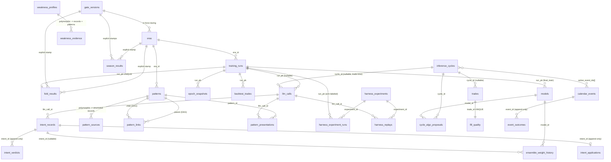

# Training-System Redesign (Stage 2.R) — Design Spec

> **Status: G1 SIGNED OFF 2026-07-07** (full-spec end-to-end review, guided read). Written
> incrementally; each topic section was locked during the Fable scoping sessions and
> committed as it closed.
> **§1 (Goal): LOCKED 2026-06-12.** **§2 (Topic 2): LOCKED 2026-07-06.** **§3 (Topic 2.5,
> Meta-Trader): LOCKED 2026-07-06.** **§4 (Topic 3, data model): LOCKED 2026-07-06.**
> **Amendments: A1–A25 applied 2026-07-06 after a four-lens adversarial review; A26 applied
> 2026-07-07 during the G1 read; A27–A29 applied 2026-07-07 during the G2 Plan A walkthrough —
> log: §4.15.**
> **Next: G2 implementation plan (writing-plans) → targeted code-verification review.**
> **Kickoff:** `.planning/REDESIGN_SCOPING_KICKOFF.md` ·
> **Tracker:** `.planning/V1.1_EXECUTION_PLAN.md` ▶ Stage 2.R
> **Gates:** topic-level approval in conversation → full-spec G1 sign-off ✅ (2026-07-07)
> → implementation plan (G2) → targeted code-verification review → only then run/replace the
> Stage 2 runbook (A/B/D/E).

---

## §1 — Goal (LOCKED 2026-06-12)

### §1.1 What the training system is for

Produce deployable trading policies that grow capital without unrecoverable loss — scored per
iteration by **CPS v1 (multiplicative)**:

```
CPS v1 = median_return × (1 − max_mdd)² × tanh(mean_winner_sharpe / 2) × pass_ratio
```

(`max_mdd` = the single worst fold's drawdown; `pass_ratio` = fraction of folds passing the
per-fold validation gate. Implementation: `src/swingrl/metrics/cps.py`.)

### §1.2 The redesign's goal — five pillars

1. **Scoring is trustworthy.** CPS v1 is the single training objective; v2/v3 computed as
   cross-checks (v2 trusted only after the `max_single_loss` dollars→fraction fix). The score is
   **regime-blind** — a crisis drawdown costs full price. This is deliberate: under the
   multiplicative math, going defensive in a single crisis fold is cheap (median_return is robust
   to one ~0 fold; `(1−max_mdd)²` is protected) while systemic timidity is catastrophic — so the
   score already rewards the desired crisis behavior. **Validation gates are re-derived to align
   with CPS**: the current per-fold gate (`sharpe > 0.7, mdd < 0.15, profit_factor > 1.5,
   overfitting_gap < 0.20`) is pre-CPS, has no return or activity floor, and provably rewarded
   trade-shyness (iter 4–5: A2C returns fell 6.0% → 4.9% while pass rate *rose*); it leaks into
   CPS via `pass_ratio`. The ensemble gate (`sharpe > 1.0 AND |mdd| < 0.15`) gets the same review.
2. **The coach's authority is explicit and bounded.** The redesign enumerates the complete lever
   set — how many levers, which ones, what bounds, what cadence, what scope (per-epoch /
   per-fold / per-iteration). Every path by which the coach influences training is a named lever;
   any unenumerated influence path (e.g. the `_SAFE_DEFAULTS` cold-start weight shift,
   `services/memory/memory_agents/query.py:122–131`) is a bug. Each lever's blast radius is
   stated: what it can move, by how much, how fast.
3. **The coach earns its keep.** The meta-trainer is judged by **lever-attributable uplift over
   control**: one lever per iteration (per
   `.planning/research/reward-shaping-vs-hyperparameters.md` §5/§9 — simultaneous reward-weight +
   HP changes make attribution mathematically impossible); every retained lever cheaply proven to
   move training in the intended direction *before* any expensive re-run; **benching rule** — no
   demonstrated uplift → the coach is removed and control becomes production. The uplift judgment
   is **regime-aware**: control folds are fixed calendar windows (equity `[0,5,10,15,20]`, crypto
   `[0,4,9,13]`), so a disaster fold with no control-arm regime counterpart is flagged and
   excluded from the benching verdict, not silently counted (per-fold regime context exists:
   `backtest_results.hmm_p_bull/hmm_p_bear/vix_mean`).
4. **The coach sees the game — including the consequences of its own calls.** Every decision in
   the lever set has named information requirements, gaps identified and filled; no decision is
   asked of the coach without the data to make it. Every lever pull records a **falsifiable
   intent** (target metric + expected direction + horizon) at pull time; the realized effect is
   measured *against that intent* and the verdict — per-pull and as an aggregated per-lever track
   record — is fed back into the coach's context. No silent pulls, no intent-free verdicts. (The
   current `effective` flag — `sharpe_delta > 0 OR mdd_delta > 0` — is not intent-aware: a
   risk-reduction pull that increased risk but bumped Sharpe is marked "effective". This is the
   failure being designed out.)
5. **The record outlives the run.** Every captured record is structurally attributable to
   **iteration / run / fold / env / algo** via schema keys (never text parsing); units explicit;
   payloads machine-readable; volume bounded by fixed cadence/thresholds. The bar: a future coach
   can reconstruct the game — re-consolidation and trend analysis of any past iteration — from
   the record alone. The 4.9M-row unusable-corpus failure (zero structural keys; 83% of rows
   tagged `*:historical` with env/algo unrecoverable; undeclared units inside pattern text) must
   be structurally impossible to repeat.

### §1.3 Success criteria

| # | Criterion | Test |
|---|---|---|
| S1 | Treatment/control CPS v1 ratio ≥ 1.0 on the next full run † | Extend the harm table (handoff §"empirical case"); regime-aware comparison |
| S2 | Treatment worst-fold MDD ≤ control's (+ agreed margin) † | Per-season check against `season_results.worst_fold_mdd_frac` (era 1+); margin value → §4.14 hand-off |
| S3 | Every lever pull has recorded before/after attribution | No advice row without identity + outcome columns |
| S4 | Re-consolidation of a past iteration succeeds from captured data alone | Dry-run produces patterns with correct iteration/fold/env/algo |
| S5 | Gates re-derived and documented | Pass rate can no longer rise while returns fall |
| S6 | Each retained lever passes a cheap directional verification before the re-run | Lever-verification harness results on record |
| S7 | The lever inventory is exhaustive | Audit finds no training-influence path outside it |
| S8 | Every pull carries an intent and gets an intent-matched verdict; prompts include the per-lever track record | A risk-reduction pull cannot be marked effective by a Sharpe improvement alone |

† **Approved amendment (D-T2.5, 2026-07-06):** "control" in S1 means the **coach-free reference
season** (iteration 5 under baseline HPs + `DEFAULT_WEIGHTS`), compared season-over-season on
identical folds — not within-iteration control folds. Rationale in §2.5; the within-iteration
control-fold mechanism is retained dormant for L1 live re-earn only.
**Pre-G1 amendment A1 (2026-07-06):** the same redefinition applies to **S2** — its "control"
is the reference season, compared same-fold season-over-season; the "+ agreed margin" value is
finalized in the implementation plan (§4.14 hand-off).
**Editorial note (A2):** forward-looking references to `backtest_results` in §1–§2 read as
`fold_results` from era 1 onward (§4.3); era-0 evidence keeps the legacy table.

### §1.4 Out of scope

- Live-trading bugs: F1 turbulence column (`execution/pipeline.py:537`); shadow-promotion
  directory mismatch (`models/active/{env}/` flat vs `{env}/{algo}/` expected) — recorded in §5,
  not fixed here.
- Stage 3 repository refactor (incl. the `bounds.py` / `query.py` `_FALLBACK_REWARD_BOUNDS`
  duplication — Stage 3.4).
- GHA coverage check (issue #18).
- CPS formula redesign; new RL algorithms.
- `DEFAULT_WEIGHTS` changes — unless Topic 2 explicitly reopens it as a single-variable
  controlled experiment.

### §1.5 Topic 1 decisions log

| # | Decision | Rationale |
|---|---|---|
| D-T1.1 | CPS v1 confirmed single objective (v2/v3 cross-checks; v2 post-units-fix) | Multiplicative form structurally punishes trade-shyness; spec D3 rationale survived re-examination; v2 currently corrupted by the dollar bug (equity v2 negative at iters 3–4 in live data) |
| D-T1.2 | "Maintain risk while increasing profit" encoded as a **guardrail/acceptance criterion** (S2), not a formula change | CPS prices risk steeply (~+27% return needed to pay for 10%→20% MDD) but has no ceiling; a hard ceiling in the score risks Goodhart cliff-edge games |
| D-T1.3 | Crisis handling: score regime-blind, coach evaluation regime-aware | Capital doesn't care why it was lost; but the coach must not be benched for crisis folds control never faced (fixed control fold indices = different calendar windows) |
| D-T1.4 | Gates misaligned with CPS; re-derivation **in scope** (criteria decided in Topic 2) | Empirical proof: pass rate rose while returns fell (iter 4–5); `pass_ratio` is a CPS factor, so gate misalignment corrupts the objective |
| D-T1.5 | Intent→outcome closure mandatory for every lever pull | Current `effective` flag is intent-blind; live rows show decision/action mismatch (see §1.6) |

### §1.6 Evidence base (verified during scoping, 2026-06-11/12)

- **Harm table:** control beat treatment 2.7–5.1× CPS across iters 3–4 (+ wiped iter 5);
  equity treatment max-MDD 0.36–0.38 vs control 0.067–0.069. (`PHASE_19.1_HANDOFF.md`, C0 §6.)
- **Gate rewarding harm:** iter 4–5 A2C returns 6.0% → 4.9% while pass rate rose (C6
  anti-pattern block).
- **Group C merged ≠ deployed:** the 6 `reward_adjustments` attribution columns do **not** exist
  in live pg16 (verified 2026-06-12); migration rides the container rebuild. The design must
  treat "merged" and "deployed/migrated" as separate states.
- **Lever bookkeeping contradicts action:** live `reward_adjustments` rows (ids 2, 3) have
  `trigger_reason` = "keeping baseline — insufficient evidence" yet `weight_after ≠
  weight_before`.
- **Provenance vacuum:** `memories` (4,958,918 rows) has only
  `id/text/source/created_at/archived` — no iteration/run/fold/env/algo columns; 83% of rows are
  `*:historical` with env/algo unrecoverable. `training_epochs` (850,430 rows) and
  `reward_adjustments` carry no iteration/fold columns; `run_id` is free text in ≥3 formats
  (`{env}_{algo}_fold{N}`, `…_fold{N}_CTRL`, `{env}_{algo}_{timestamp}Z`).
- **Iter-5 vestiges outside structured tables:** 1,835 `pattern_presentations` rows + 2
  `pattern_outcomes` rows tagged iteration 5 survive the Plan-A landscape.
- **Observability mismatch:** wrapper rolling metrics use a 500-step window; SAC's adjustment
  cooldown is 20,000 steps — the coach's view is 40× shorter than its minimum action interval.
- **Restriction precedent:** mid-fold reward lever already hard-disabled for PPO-crypto
  (`_MAX_REWARD_DELTA["ppo"]["crypto"] = 0.0`, `bounds.py:110`) after iter-4 analysis (~29.5%
  treatment underperformance).
- **Units chaos:** `max_single_loss` confirmed dollars (to −19,871) where CPS v2 expects a
  fraction; `reward_adjustments.trigger_value` mixes fraction-scale and multiple-scale values;
  JSON stored as `text` not `jsonb`; several date columns stored as `text`.

---

## §2 — Meta-trainer decision-set + observability (Topic 2 — LOCKED 2026-07-06)

Every §2 scope-checklist item is resolved by decisions D-T2.1–D-T2.11 (log: §2.9). The coach's
governing posture: **iteration-scale coach only** — no live mid-fold influence path — until
levers individually re-earn scope via §2.3 + §2.4.

### §2.1 Lever posture (D-T2.1)

| Lever | Decision | Blast radius when live |
|---|---|---|
| **L1** mid-fold reward-weight adjustment | **BENCHED** for all (env, algo) pairs: `_MAX_REWARD_DELTA` = 0.0 everywhere (config posture via the existing PPO-crypto mechanism, `bounds.py:110` — no code deletion). Runs in **shadow** (§2.4). Re-earn per (env, algo): §2.3 harness pass + §2.4 judgment track record | Per-epoch; component clamps + per-(env,algo) max-delta; step-based cooldowns (PPO 24,576 / A2C 500 / SAC 20,000) |
| **L2** between-iteration HP tuning | **RETAINED** — the coach's primary live lever, staged in per the §2.5 staircase | Once per (env, algo, iteration); double-clamped (service + trainer); every pull carries an intent record (§2.4) |
| **L3** consolidated patterns → prompts | **RETAINED** — corpus discarded/regenerated (disposition formalized in Topic 3). Structural note: with L1 benched, L3 has **no independent actuator** — its live channel is the L2 run-config prompt. Evaluated as the marginal value of patterns on L2 advice (§2.5) | Per iteration; top-3 per category, min confidence 0.4; patterns must pass C6 §7 QA (absorbed into §2.3 Stage 2) |
| New levers (position sizing, trade-frequency caps, regime vetoes, conviction thresholds) | **DEFERRED** → §2.10 future-levers appendix with pre-written verification requirements | — |

### §2.2 Unenumerated influence paths closed (D-T2.2, S7)

| Path | Decision |
|---|---|
| **U1** `stop_training` flag (`query.py:996–999`; actuated `epoch_callback.py:694–713`) | **Advice-only.** Runtime ignores the flag — folds always run to completion. A stop request is logged with full context and graded post-fold like any bet ("was the fold, in fact, wasted?"). Evidence: **0 stop requests in 850,430 live epochs** (pg16, verified 2026-06-15) — never-used power, no case for keeping actuation. Promotion to a real lever requires the §2.10 appendix path |
| **U2** `_SAFE_DEFAULTS` cold-start (`query.py:122–131`) | Cold-start/fallback weight sets **must equal `DEFAULT_WEIGHTS`** — the silent 4-weight shift is a bug, fixed in the implementation plan |
| **U3** service-failure fallback behaviors | **Audit item** for the targeted code-verification review: enumerate every fallback default; each must be identity with baseline (no influence) or become a named lever |

After these closures the lever inventory of §2.1 is exhaustive (S7); any further influence path
found in the code review is a defect against this section.

### §2.3 Lever-verification harness (D-T2.3, S6)

Two stages; a lever goes live only after passing both. Harness runs are standalone (reuse
trainer + data + folds; models discarded); every harness record carries a run-type quarantine
tag and is **never consolidated** into patterns/memories (schema in Topic 3).

- **Stage 1 — mechanics, no LLM.** Scripted pull of known direction/magnitude on one fold,
  shortened run: **3 seeds with the pull vs 3 same-seed controls; majority of seed-pairs must
  agree with the intended direction** without collapsing trade activity. Minimum run length per
  (algo, lever): ≥ cooldown + one trend-window measurement period (table of exact lengths in the
  implementation plan). The 6 runs are independent → run in parallel.
- **Stage 2 — judgment, no training.** Replay recorded fold situations to the coach with
  **production-identical prompts** (including regenerated patterns); grade against the
  deterministic diagnosis→correction menu (`cps_diagnosis.py`) and fold-protection rules.
  Absorbs the C6 §7 Group-D pattern-QA criteria — a Stage-2 failure indicts prompt or pattern.
- **Fold selection:** a **neutral fold is the gate**. The chronic-failure tryout is additionally
  required when (a) the lever is fold-targeted and its permitted scope includes
  `chronic_failure` folds (true for any L1 re-earn — the fold-protection blocks steer reward
  shaping there), or (b) at runtime, a live lever's failed bets cluster on chronic-failure folds
  (retroactive trigger → pass it or lose that scope).

### §2.4 Shadow mode + intent records (D-T2.4, D-T2.8; S8, D-T1.5)

Epoch advice keeps running with production prompts but is **log-only**: nothing the coach says
mid-fold changes the run. Every lever call — shadow L1, U1 stop requests, and **live L2 pulls
alike** — writes a five-block **intent record**:

1. **Identity** — iteration / run / fold / env / algo / epoch / timestep + %-complete /
   advice_id / mode (`shadow`|`live`) / lever.
2. **Evidence snapshot** — both observation windows' metrics (§2.6), diagnosis + confidence,
   fold role, current weights/HPs. Self-contained: graders never join other tables.
3. **Proposal** — the change (or explicit no-change) + rationale.
4. **Falsifiable bet** — target metric + expected direction + horizon. **Horizons are
   system-fixed, never coach-chosen** (aggregability; no gaming): mid-fold = one trend window
   after the call; L2 = one season, verdict via same-fold season-over-season comparison.
5. **Verdict** (deterministic, post-horizon) — actual value, direction-match, plus an immediate
   menu-consistency check. Replaces the intent-blind `effective` flag (D-T1.5).

**Grading semantics (honest limits):** shadow verdicts grade **judgment** — was the diagnosis
right, did the prognosis materialize absent intervention — not treatment effect (the action was
never applied). Treatment effect is Stage 1's job. **Re-earn = medicine proven (harness) +
judgment proven (shadow track record).** Prognosis grading needs no control arm: the bet is
about the fold's own future. Aggregated per-lever/per-scope track records are fed into the
coach's prompts each iteration (S8).

### §2.5 Attribution model + staircase schedule (D-T2.5, D-T2.6)

**Verified finding that reshaped this section:** control folds were only ever shielded from
epoch advice (`backtest.py:384`); **advised HPs reached all folds including controls**
(`backtest.py:393`, unconditional). Consequences: (a) the 2.7–5.1× harm indicts the **mid-fold
lever alone** — both arms shared HPs; (b) with L1 benched, within-iteration arms would differ
by nothing live.

- **Active control arm dropped.** Its question ("does mid-fold advice help?") is answered.
  The mechanism (yaml `control_folds_*`) is **retained dormant** solely for L1 live re-earn.
- **Reference season:** iteration 5 runs coach-free — baseline HPs, `DEFAULT_WEIGHTS`, shadow
  coach mic'd up with full production prompts. This is the bar every lever season must beat.
- **Season-over-season comparison on identical folds:** fold boundaries are deterministic and
  calendar-stable (`backtest.py:202` — new data only appends folds), so iter-N fold-k vs
  iter-M fold-k is a same-regime comparison; the D-T1.3 regime confound dissolves for lever
  evaluation. **Per-fold seeds pinned across iterations** (feasibility → code review) so the
  lever is the only variable.
- **Staircase (one change per season):** iter 5 reference → iter 6 **L2 bare** (HP advice,
  patterns withheld from the prompt) → iter 7 **L2 + regenerated patterns** (measures L3's
  marginal value) → iter 8+ decided by the track record and the §2.7 ladder.
- **S1 amendment** recorded (see §1.3 footnote).
- **Era-1 training environment — live parity (A28, 2026-07-07; full definition → Plan B):**
  era-1 models train in an environment matching what they will face live: (a) **real
  turbulence values** in the observation slot — era-0 models trained with that slot frozen
  at 0.0 (bug F1b), so live inference zeroes the slot for them (`zero_turbulence_obs`
  config flag); the flag retires when era-1 models deploy; (b) **live-parity circuit
  breakers** inside the training env, so policies experience halts in training exactly as
  they will in production; (c) turbulence enters the observation as **decomposed features**
  (equity: magnitude + correlation surprise as percentile-ranks; crypto: signed volatility
  z-score + signed correlation change), never the raw composite — per the adopted method
  review (`.planning/research/turbulence-method-review.md`).

### §2.6 Observability (D-T2.7, D-T2.11; pillar 4)

- **Two observation windows per algo, defined in percent-of-fold** (measurable today:
  `num_timesteps / _total_timesteps`, cf. `epoch_callback.py:698`): a **short window**
  (~0.5–1%) as acute-change detector (keeps the trade-shy alarm live mid-cooldown) and a
  **trend window** (~12–15%, sized to cover the longest cooldown at current fold budgets) as
  the decision basis. Fixes the 500-step-window vs 20,000-step-cooldown mismatch (40×).
- **Cooldowns stay step-based** — they protect learner adaptation (SAC replay-buffer turnover,
  PPO rollout cycles), which runs on absolute steps, not fold fractions.
- **Startup guard:** at config load, assert trend-window-steps ≥ longest cooldown; refuse to
  start otherwise. Makes the eyesight-mismatch bug class structurally unrepeatable.
- **Dual-unit capture:** every windowed value recorded with both percent and absolute steps,
  units labeled (the undeclared-units corpus failure must be impossible to repeat).
- **New capture requirements surfaced by the decision audit** (→ Topic 3): L2's own
  settings-history-with-outcomes (today the run-config coach picks HPs blind to his past
  picks); **gate version + era tag + pinned seed on every season and fold record**.
- **Regime residues:** newly-appended folds are excluded from lever verdicts until played in
  two eras (counted in standings, silent in attribution); the D-T1.3 disaster-fold rule applies
  as written if control folds ever reactivate.

### §2.7 Benching ladder (D-T2.9; pillar 3)

| Level | Trigger | Response |
|---|---|---|
| 0 Noise | Single wrong bet | Record only — no reaction to single calls |
| 1 Weak spot | One scope (diagnosis label, or (env, algo)) below threshold over the minimum sample | **Scoped demotion to shadow** (the PPO-crypto precedent as a standing rule); rest of the coach unaffected |
| 2 Broad failure | A lever below threshold across scopes | Lever benched → shadow; re-earn path required |
| 3 Coach removed | No lever shows uplift over the reference season across the agreed season count | **No-coach baseline becomes production** (pillar 3's guarantee) |

Principles: **deterministic grading** — verdicts, aggregation and ladder decisions are computed
by scripts from intent records; the LLM never grades itself. **Minimum sample:** ≥10 graded
bets per scope before any ladder verdict. **Demotion threshold:** directional accuracy not
credibly better than coin flip (~<60% — exact numbers are spec *proposals*, finalized against
per-season bet volumes in the implementation plan). **Demotions are recoverable** via the same
re-earn path as L1.

### §2.8 Gate re-derivation (D-T2.10; S5, D-T1.4)

The per-fold gate (`sharpe > 0.7, mdd < 0.15, profit_factor > 1.5, overfitting_gap < 0.20`) is
replaced by a win condition that cannot mark an unplayed game a win (iter 4–5 proof: A2C
returns 6.0%→4.9% while pass rate rose):

| Requirement | Basis |
|---|---|
| **Profit floor** (NEW) | Fold return above a small positive floor |
| **Activity floor** (NEW) | Trade count above a per-(env, algo) minimum from `TRADE_BASELINES` (`cps_diagnosis.py`) |
| Risk cap | Per-env MDD ceiling (equity ≠ crypto weather) |
| Quality bar | Sharpe / profit-factor minimums, re-checked |
| Overfit cap | In-sample vs OOS gap ceiling, kept |

**Derivation + acceptance:** thresholds derived from the 564 iter-0–4 `backtest_results` rows
and validated by **offline replay** before season 5. Acceptance: (a) the fake-win anti-pattern
disappears (returns fall ⇒ pass rate falls), (b) historical pass rate lands in a sane band
(~40–70% proposed), (c) passing correlates with fold-level CPS contribution. Ensemble gate
(`sharpe > 1.0 AND |mdd| < 0.15`): same method.

**Loop safety:** the gate is a **floor, not a target** — sanity minimums; excellence is priced
by CPS's continuous factors; the coach's prompts state CPS as the sole objective and never
present the gate as a target. **No self-tuning:** live pass rate is monitored against an alarm
band; out-of-band triggers a *human-approved* review only. Every gate change is
**version-stamped and starts a new era; cross-era CPS values are never compared** (this also
covers old-era iters 0–4 vs the new gate regime).

### §2.9 Topic 2 decisions log

| # | Decision | Rationale |
|---|---|---|
| D-T2.1 | L1 benched everywhere (config max-delta 0.0); coach iteration-scale only; L2+L3 retained; new levers deferred | Only lever with direct harm evidence (2.7–5.1×, tail MDD 0.36–0.38 vs 0.067–0.069); eyesight 40× too short for its action interval; bookkeeping contradicted action (ids 2–3); pillar 3 = prove first |
| D-T2.2 | U1 advice-only; U2 must return `DEFAULT_WEIGHTS`; U3 audited | Mid-fold halt is a mid-fold lever (posture consistency); 0 uses in 850k epochs; logging preserves the signal at zero risk |
| D-T2.3 | Two-stage harness (mechanics w/o coach; judgment w/o training); 3 seeds majority; neutral gate + two chronic triggers; quarantined | Separates "tool broken" from "operator wrong" — the old system could never tell; RL noise demands seed replication |
| D-T2.4 | Shadow mode for mid-fold advice | Free judgment evidence for re-earn; trade-shy detector keeps an audience; zero influence |
| D-T2.5 | Reference-season attribution; same-fold cross-iteration comparison; pinned seeds; control mechanism dormant; S1 amended | Control arm's question is answered; HP leak (`backtest.py:393`) made arms meaningless post-benching; stable fold boundaries make same-fold comparison regime-clean |
| D-T2.6 | Staircase: iter 5 reference → 6 L2-bare → 7 L2+patterns | One variable per step; L3 has no actuator without L2; bare-first finds a harmful L2 one season sooner |
| D-T2.7 | Percent windows (short + trend), step cooldowns, startup guard, dual-unit capture | Windows serve the coach (proportions); cooldowns serve learner physics (absolute steps); guard makes the mismatch class unrepeatable |
| D-T2.8 | Five-block intent record for every pull; system-fixed horizons | Falsifiable bets or no call; fixed horizons keep track records aggregable and ungameable; kills the intent-blind `effective` flag |
| D-T2.9 | Four-level scoped ladder; deterministic grading; ≥10-bet minimum; recoverable | Punishment lands where evidence is; no self-grading; no verdicts on noise; ladder runs both directions |
| D-T2.10 | Gates: profit+activity floors, per-env caps, replay-derived, floor-not-target, no self-tuning, versioned eras | Gate leaks into CPS via pass_ratio; floors kill the fake-win channel; self-tuning gates destroy season comparability |
| D-T2.11 | Observability closeouts: L2 history, version/era/seed stamps; regime residue rules | Last gaps from the per-decision information audit (pillar 4) |

### §2.10 Future-levers appendix (deferred; D-T2.1)

Each candidate is **not designed** here; listed with the verification it must pass before any
design work (all: §2.3 two-stage harness + §2.4 intent records + §2.7 ladder from day one):

| Candidate | Pre-registered directional test (Stage 1 sketch) |
|---|---|
| Position sizing | Scripted size cap on one fold: MDD falls without return collapse beyond CPS-neutral |
| Trade-frequency caps | Scripted cap on a `churning` fold: profit factor rises, trade count falls to band |
| Regime vetoes | Scripted veto on a disaster fold: worst-fold MDD falls; healthy folds untouched |
| Conviction thresholds | Scripted threshold raise on a `poor_selection` fold: win rate rises, activity floor still met |

### §2.11 Hand-offs

- **→ Topic 3 (data model):** intent-record schema (5 blocks); dual-unit fields; gate
  version/era/seed stamps on season+fold records; harness run-type quarantine tag; L2
  settings-history capture; structural identity keys on every record type.
- **→ Code-verification review:** U3 fallback enumeration; per-fold seed-pinning feasibility;
  startup-guard placement; gate-replay SQL against the 564 rows; `_MAX_REWARD_DELTA` config
  surface for the all-pairs bench; exact minimum harness run lengths per (algo, lever).
  **Pre-G1 amendment A3 (2026-07-06):** the risk-penalty-discarded-under-shaping bug
  (`reward-shaping.md` known issue) is owned here — its fix is a **precondition of any L1
  §2.3 harness run** (a wrapper that drops the risk penalty corrupts Stage-1 verdicts).

## §3 — Meta-Trader: mission, boundaries, and data requirements (Topic 2.5 — LOCKED 2026-07-06)

A **second LLM coach for trade time** (paper + live), distinct from the §2 meta-trainer: the
meta-trainer develops players between seasons; the Meta-Trader manages them during real games.
This section is a **bounded charter** — mission, boundaries, candidate levers (listed, not
authorized), the shared weakness-profile asset, and capture requirements. The full design
(lever mechanics, authority thresholds, cadence, prompts) is **deferred to its own spec** (§3.8).

### §3.1 Mission (D-MT.1)

> The Meta-Trader is a game-day defender: it watches live and paper trading, maps sensor
> readings and scheduled events onto each player's documented weaknesses, and — only with
> earned authority — reduces a player's influence or the team's exposure before damage,
> never adding risk. It detects nothing itself, trades nothing itself, and can never
> override the referee.

Direction is **reduce-only**: every lever it could ever hold can only shrink exposure or
influence, so its worst wrong call costs upside, never unrecoverable capital. Symmetric/boosting
management is excluded from the mission; any future upgrade requires a §2.10-style appendix
path with pre-registered verification.

The structural gap it fills (true regardless of doc/code drift): between trainings, nothing
judges live form — ensemble weights are set once per training from WF Sharpe
(`pipeline_helpers.py:219–256`) and read per cycle (`execution/pipeline.py:410–445`); the only
in-game protections are deterministic tripwires that fire *after* damage. The Meta-Trader is
the judgment layer on the middle timescale: faster than retraining, earlier than the breakers.

### §3.2 Division of labor (D-MT.2)

| Condition | Detected by | Response |
|---|---|---|
| Crash (vol spike, loss breach) | Circuit breakers (deterministic, existing) | Breakers halt — the Meta-Trader is never in this loop |
| Regime shift | Statistical sensors (HMM p_bull/p_bear, VIX features — existing) | Meta-Trader *interprets* against weakness profiles |
| Scheduled events (FOMC, CPI, earnings) | Script + calendar feed (new plumbing, no LLM) | Meta-Trader *interprets significance* |
| Rule violations | Risk layer + broker middleware | Deterministic veto — the Meta-Trader always sits behind it |

The Meta-Trader's **only unique job is interpretation**: does the current picture — sensor
readings + upcoming events + recent per-player behavior — match a documented weakness of a
specific (algo, env), and is reducing that player's influence warranted *before* the tripwires
fire? It never detects (sensors are faster and better at that) and never trades (the players
are the traders).

### §3.3 Day-one duties — no authority (D-MT.3)

Active from paper trading onward; all outputs advisory and graded:

1. **Commentator** — periodic structured judgment on live/paper telemetry: diagnosis, matched
   weakness signature + confidence, proposal, falsifiable bet. Log-only; written as §2.4
   five-block intent records, mode=`shadow`, system-fixed horizons, deterministic grading.
2. **Alarm-raiser** — escalate-to-human (Discord) when a weakness signature fires or an
   unscheduled event warrants a look. Advisory only; escalations are themselves graded calls.
3. **Event-significance interpretation** — weighs upcoming *scheduled* events in context;
   output feeds its own commentary/alarms only.

### §3.4 Candidate lever set (LISTED, NOT AUTHORIZED; D-MT.4)

All reduce-only. Each goes live only after its own §2.3-style harness pass + shadow track
record + §2.7 ladder standing — pre-registered in the future Meta-Trader spec:

| Candidate | Action | Natural surface |
|---|---|---|
| Ensemble tilt (down) | Reduce a flagged player's blend weight, bounded | `model_metadata` ensemble weights read per cycle (`execution/pipeline.py:410–445`) |
| Position-size scaling (down) | Shrink sizes when a flagged player drove the decision, or env-wide | Sizing path in `execution/` |
| Live benching | Player weight → 0, time-boxed, recoverable | Same weight surface |
| Per-algo trade veto | Block trades where the flagged player was the driver | Pre-middleware check |
| Pre-event de-risk | Reduce/veto new entries in a defined window around scheduled high-impact events | Calendar-triggered; highly gradeable (each CPI/FOMC print is a repeated natural experiment) |

Flagged unknown (honest gap): whether pre-event de-risking is net-positive for a swing
strategy at all — plenty of setups profit from post-event moves. Answered by its shadow track
record before any authority question arises.

### §3.5 Prohibitions / hard caps (D-MT.5)

- **No play-calling** — per-order approve/modify is being a trader, not a coach.
- **No posture-switching** — team-wide defensive/cash calls duplicate the circuit breakers in
  the most expensive seat; the escalation path covers the genuine cases.
- **No autonomous action on unscheduled/breaking news, ever** — news text is untrusted input
  to a system with trade authority (hallucination + injection risk); escalate-only, permanently.
- **No training-side influence** — not a side door for new training levers or unbenching L1
  (§2.10 remains the only path).
- **No LLM-to-LLM channel** with the meta-trainer (§3.6).

### §3.6 Shared weakness profiles (D-MT.6)

One **script-maintained** asset per (algo, env): failure mode → data signature → early
detectability → evidence rows. Seeded from existing training-time knowledge
(`.planning/research/hp-tuning-reference.md` per-algo diagnostics; iter-1 forensics and
per-algo reward sensitivity in `reward-shaping-vs-hyperparameters.md` §6/§10); enriched by
structured live records as they accumulate. **Both coaches read it; neither writes it
directly** — scripts and consolidation maintain it from graded records. This replaces the
earlier "Meta-Trader feeds Meta-Trainer" sketch: there is no coach-to-coach advice channel,
only a shared, attributable evidence base.

### §3.7 Capture requirements → Topic 3 (D-MT.7)

Start accumulating at paper trading (cold-start avoidance — the time-critical part of this topic):

1. **Per-cycle per-player record**: each algo's proposed action vs the blended action vs
   actual fills — today only the blend is visible, so live per-algo behavior is unattributable.
2. **Regime context stamped on trade records** (HMM probabilities, VIX at decision time).
3. **Event-calendar ingestion + event-stamping** on trades, verdicts, and grading windows —
   event shocks must not silently contaminate weakness attribution (the D-T1.3 disaster-fold
   exclusion applied at trade time: don't grade a player on a game played in a hurricane).
4. **Meta-Trader intent records** — §2.4 five-block format, system-fixed horizons,
   mode=`shadow` from day one.
5. **Slippage / fill-quality vs backtest expectation per algo** — the train-vs-live transfer
   signal (e.g. does a model's backtest trade-rate survive contact with live markets).

### §3.8 Governance preconditions + deferral (D-MT.8)

The §2 template applies wholesale as a precondition: shadow-first; deterministic grading (the
LLM never grades itself); ≥10 graded bets per scope before any ladder verdict; the §2.7
benching ladder in both directions; always behind broker middleware + the risk-veto layer
(CLAUDE.md critical rule). **Full lever design is deferred to a dedicated Meta-Trader spec**,
gated on (a) the §3.7 capture data existing and (b) the §2 machinery operating in code —
designing levers before the signatures exist would repeat the original meta-trainer's sin
(levers never verified).

### §3.9 Topic 2.5 decisions log

| # | Decision | Rationale |
|---|---|---|
| D-MT.1 | Mission = reduce-only game-day defender; boosting excluded | Worst wrong call = missed upside (recoverable) — matches capital preservation + the 2.7–5.1× humility prior; upgrade only via appendix path |
| D-MT.2 | Detect/interpret split: breakers own crashes, sensors own regimes, calendar is plumbing; the LLM interprets only | Deterministic layers are faster and more reliable at detection; interpretation against weakness profiles is the one judgment no threshold expresses |
| D-MT.3 | Day-one duties advisory-only (commentator / alarm-raiser / event significance), intent-recorded from day one | Free evidence at zero risk; builds the graded track record any authority must be earned from |
| D-MT.4 | Five candidate levers listed, none authorized; all reduce-only | Player-level levers match the weakness-compensation intent; each must individually earn scope (§2 pattern) |
| D-MT.5 | Hard caps: no play-calling, no posture-switching, no autonomous news action, no training-side influence, no LLM-to-LLM channel | Keeps the Meta-Trader a coach not a trader; keeps untrusted input away from trade authority; keeps §2's governance closed |
| D-MT.6 | Weakness profiles = one shared script-maintained asset consumed by both coaches | Replaces an ungradeable coach-to-coach channel with an attributable evidence base |
| D-MT.7 | Five capture requirements start at paper trading | The signatures the whole design depends on don't exist yet; capture is the only time-critical piece |
| D-MT.8 | Full design deferred to its own spec, gated on capture data + §2 machinery operating | Designing levers without signatures = the original unverified-lever mistake |

### §3.10 Hand-offs

- **→ Topic 3 (data model):** the five §3.7 capture requirements as first-class record types
  (per-player cycle records, regime/event stamps, trade-time intent records, fill-quality
  records); the event calendar as a new ingested data source; all under the same
  structural-identity-key regime as §2.11.
- **→ Future Meta-Trader spec:** lever mechanics + bounds, authority-ladder thresholds,
  cadence, prompt design, harness adaptation for trade time (what "3 seeds" becomes when the
  fold is a live window).

## §4 — Durable memory-capture data model (Topic 3 — LOCKED 2026-07-06)

Every §4 scope-checklist item is resolved by decisions D-T3.1–D-T3.20 (log: §4.13). The record
inventory covers 18 types: 7 existing types redesigned, 6+ new tables, 3 derived views, 1
collapsed (#16 → #13), and 3 tables retired (`memories`, `meta_decisions`, `pattern_outcomes`).
Governing bar (pillar 5): a future coach can reconstruct any past season — re-consolidation and
trend analysis — from the record alone (S4, §4.11).

### §4.1 Identity spine + registries (D-T3.1, D-T3.4)

**`training_runs`** — the universal identity mechanism. Every run-scoped record carries one
`run_pk` FK instead of any text ID; the 4.9M-row "no iteration column / free-text `run_id`"
failure becomes structurally unrepeatable (UNIQUE constraint, not discipline).

| Field | Type | Notes |
|---|---|---|
| `run_pk` | `BIGINT` identity PK | The one key every other table references |
| `iteration_number` | `SMALLINT` NOT NULL | Season |
| `environment` | `TEXT` CHECK (`equity`,`crypto`) | League |
| `algorithm` | `TEXT` CHECK (`ppo`,`a2c`,`sac`) | Player |
| `fold_number` | `SMALLINT` NOT NULL | Game |
| `run_type` | `TEXT` CHECK (`season`,`reference`,`harness_stage1`,`harness_stage2`,`final_train`,`l1_reearn_control`) | §2.3 quarantine tag + deployable-model training + the dormant §2.5 control-fold arm's capture surface for L1 live re-earn (A5) |
| `seed` | `INTEGER` NOT NULL | Pinned seed (D-T2.5) |
| `attempt` | `SMALLINT` default 1 | Re-runs are new rows, never overwrites |
| `status` | `TEXT` CHECK (`running`,`completed`,`failed`,`aborted`) | Crash semantics explicit; a retry is a new `attempt` row (A4) |
| `era_id` | `SMALLINT` NOT NULL → `eras` | Known at run start; run-scoped records inherit era via the spine |
| `code_version` | `TEXT` NOT NULL | Git SHA / image digest — a dependency bump between seasons must never masquerade as a lever effect (A12) |
| `config_hash`, `config_snapshot` | `TEXT`, `JSONB` | The yaml in force, hashed + snapshotted at run start (A12) |
| `data_fingerprint` | `TEXT` NOT NULL | Row count + hash of the fold's OHLCV slice at run start — pins D-T2.5's same-fold comparison against gap-fill data revisions (A12) |
| `started_at` / `finished_at` | `TIMESTAMPTZ` | UTC |
| UNIQUE(iteration, env, algo, fold, run_type, attempt) | | Duplicates impossible |

**Canonical-run rule (A6):** for any (iteration, env, algo, fold, run_type), the canonical run
is the **highest `attempt` with `status = 'completed'`**. Every aggregation and view — season
CPS computation, `v_consolidation_corpus`, D-T2.5 same-fold comparison, S4 coverage — binds to
canonical runs only. Non-canonical attempts remain on record (forensics) but never count.

**`gate_versions`** — the rulebook editions (D-T2.10). Human-approved changes only; never
written by training code.

| Field | Type | Notes |
|---|---|---|
| `gate_version_id` | `SMALLINT` PK | **Surrogate key (A29)** — the version number cannot be the PK: per-fold v0 and ensemble v0 would collide |
| `gate_type` | `TEXT` CHECK (`per_fold`,`ensemble`) | Both gates versioned here |
| `version_number` | `SMALLINT` NOT NULL | Edition number within its `gate_type` |
| `definition` | `JSONB` | Full rules machine-readable: each §2.8 requirement with per-env / per-(env,algo) thresholds |
| `derivation_evidence` | `TEXT` | Pointer to the replay run / spec section justifying thresholds |
| `approved_by`, `approved_at` | `TEXT`, `TIMESTAMPTZ` | No self-tuning (D-T2.10) |
| UNIQUE(`gate_type`, `version_number`) | | Editions stay unique per gate type (A29) |

**`eras`** — the comparability periods. A gate change (or any scoring-comparability break, e.g.
a CPS formula fix) starts a new era; **cross-era CPS values are never compared**.

| Field | Type | Notes |
|---|---|---|
| `era_id` | `SMALLINT` PK | |
| `reason` | `TEXT` | What started it |
| `gate_version_per_fold`, `gate_version_ensemble` | `SMALLINT` → `gate_versions (gate_version_id)` | Editions in force this era (A29 surrogate; column names unchanged) |
| `first_iteration` | `SMALLINT` | Seasons ≥ this belong to the era |
| `started_at` | `TIMESTAMPTZ` | |

**Era mechanics (A7):** era rows are created by the same human-approved migration process as
`gate_versions` — never by training code. The trainer resolves the current era at run start as
`max(era_id) WHERE first_iteration ≤ current iteration`; `first_iteration` carries a
monotonicity CHECK so a pre-created future era cannot mis-stamp in-flight runs. The
era-0/gate-v0 bootstrap migration (including back-stamping the 574 kept rows) is a §4.14 item.

**`schema_migrations`** (A7b) — the eighth registry: `(version SMALLINT PK, description TEXT,
applied_at TIMESTAMPTZ)`, written by the migration runner itself. "Which DDL is this database
running" becomes answerable by query — the structural fix for the documented
"merged ≠ deployed" drift class (§1.6). Detail (runner, fingerprint assertion at container
start) → G2.

**Stamping rule:** fold and season records carry **both** `era_id` and gate version(s)
explicitly (deliberate belt-and-suspenders redundancy per D-T2.11 — a result row answers
"which rules judged me" without a join); epoch and other run-scoped records inherit era via
`run_pk` only. **Iterations 0–4 are retro-registered as era 0 / gate version 0** (the pre-CPS
gate) — kept as evidence, never score-compared to the new regime.

### §4.2 Topic-wide conventions (D-T3.2, D-T3.9)

1. **Units live in column names**: `_frac` (fraction 0–1), `_usd`, `_annualized`, `_steps`,
   `_pct_of_fold`, `_ms`. Sign conventions declared in column comments (e.g. slippage:
   positive = adverse, side-aware). No bare numbers with ambiguous scale.
2. **`JSONB`, never JSON-as-`TEXT`**; every JSONB payload declares units per key.
3. **No narrative-only records**: free text (e.g. a pattern's prompt rendering) is allowed
   only alongside a structured, machine-readable payload.
4. **No-UPDATE immutability**: history is append-only. Verdicts, regrades, weight changes,
   profile revisions, event outcomes are new rows, never edits. (Kills the invisible-recompute
   and "said keeping-baseline, weights changed anyway" bug classes.)
5. **Never store the derivable**: anything cleanly computable from keyed records is a view
   (`v_l2_settings_history`, per-lever track record, pattern effectiveness, `v_live_transfer`)
   — a stored copy can drift; a view cannot.
6. **Dual-unit capture** for windowed/progress values: absolute steps + percent-of-fold, both
   labeled (D-T2.7).
7. **Every structured JSONB payload carries a `schema_version` key** (A8) — `evidence`,
   `claim`, `gate_components`, `coach_config`, `learner_metrics`, etc. all evolve; graders and
   re-consolidation parse payloads years after they were written and must know which shape
   they are reading.

### §4.3 Training records (D-T3.3, D-T3.5, D-T3.16)

**`epoch_snapshots`** (replaces `training_epochs`) — vitals during a game, cadence + capped
events (§4.10). Drops `stop_training`/`rationale` (coach calls → intent records §4.4) and
`is_control_fold` (identity → spine).

| Field | Type | Unit | Notes |
|---|---|---|---|
| `id` | `BIGINT` identity PK | — | |
| `run_pk` | `BIGINT` NOT NULL → `training_runs` | — | Full identity via one join |
| `epoch` | `INTEGER` | count | |
| `timestep` | `BIGINT` | absolute steps | Dual-unit pair (D-T2.7) |
| `pct_complete` | `REAL` | fraction 0–1 | |
| `mean_reward` | `DOUBLE PRECISION` | shaped-reward units | Pathway labeled |
| `learner_metrics` | `JSONB` NOT NULL | per key | **Per-algo key contract** (PPO: kl/clip; SAC: actor/critic loss, ent_coef) validated in code — kills the PPO-only-keys bug |
| `window_short` | `JSONB` | declared inside | `{pct, steps, sharpe_annualized, mdd_frac, win_rate, trade_rate}` — acute detector |
| `window_trend` | `JSONB` | same | Decision-basis window (§2.6) |
| `reward_weights` | `JSONB` | fractions, sum 1.0 | |
| `notable_event` | `TEXT` nullable | enum §4.10 | Rate-limited per (type, trend window) |
| `created_at` | `TIMESTAMPTZ` | UTC | |

Window MDD is redefined as an **equity fraction** (portfolio-value based), not reward-cumsum —
wrapper behavior change, flagged to the code review (§4.14).

**`fold_results`** (replaces `backtest_results`) — the box score. **Single writer** (today's
plain/rich two-writer split collapses — change-site in §4.14).

| Field | Type | Unit | Notes |
|---|---|---|---|
| `id` | `BIGINT` identity PK | — | Surrogate PK for polymorphic addressability (A11) |
| `run_pk` | `BIGINT` NOT NULL → `training_runs`, **UNIQUE** | — | One box score per run; read-time dedup dies |
| `era_id` | `SMALLINT` NOT NULL → `eras` | — | Explicit stamp |
| `gate_version_id` | `SMALLINT` NOT NULL → `gate_versions (gate_version_id)` | — | Explicit stamp (A29 surrogate) |
| `seed` | `INTEGER` NOT NULL | — | Denorm from the spine — honors D-T2.11's "pinned seed on every fold record" as written (A11) |
| `fold_role` | `TEXT` CHECK (`neutral`,`chronic_failure`,`disaster`,…) | enum | §2.3 fold selection queries this |
| `fold_start_ts` / `fold_end_ts` | `TIMESTAMPTZ` | UTC | Same-fold cross-season joins (D-T2.5); TIMESTAMPTZ not DATE — crypto 4H fold boundaries fall intra-day (A11) |
| `oos_return_frac` | `DOUBLE PRECISION` | fraction | |
| `oos_sharpe_annualized`, `oos_sortino_annualized`, `oos_calmar` | `DOUBLE PRECISION` | annualized | |
| `oos_mdd_frac` | `DOUBLE PRECISION` | fraction ≥0 | Feeds CPS `max_mdd`, S2 |
| `is_sharpe_annualized`, `is_return_frac` | `DOUBLE PRECISION` | annualized / fraction | Overfit check inputs |
| `overfitting_gap`, `overfitting_class` | `DOUBLE PRECISION`, `TEXT` | IS−OOS Sharpe | |
| `profit_factor` | `DOUBLE PRECISION` | ratio | |
| `trade_count` | `INTEGER` | count | Feeds the activity floor |
| `win_rate_frac` | `DOUBLE PRECISION` | fraction | |
| `max_single_loss_frac` | `DOUBLE PRECISION` | **fraction of capital** | **The CPS-v2 units fix** (dollars column dropped) |
| `initial_capital_usd` | `DOUBLE PRECISION` | USD | Dollars recoverable as `frac × base` |
| `gate_passed` | `BOOLEAN` | — | The verdict… |
| `gate_components` | `JSONB` | declared per key | …and the working: each §2.8 requirement with threshold + actual + pass — every verdict auditable and replayable |
| `hmm_p_bull`, `hmm_p_bear` | `DOUBLE PRECISION` | probability 0–1 | Regime context (D-T1.3) |
| `vix_mean` | `DOUBLE PRECISION` | index points | |
| `turbulence_mean` | `DOUBLE PRECISION` | score (Mahalanobis distance) | Fold-window regime context alongside `hmm_*`/`vix_mean` (A27) — era-1 comparability with the trade-time stamp (§4.7) |
| `created_at` | `TIMESTAMPTZ` | UTC | |

**`season_results`** (replaces `iteration_results`) — one row per (iteration, environment,
**scope**), scope ∈ (`ppo`,`a2c`,`sac`,`ensemble`). The benching ladder judges per-(env, algo)
scopes, so player-level season lines are first-class rows. Drops all treatment/control split
columns (obsolete per D-T2.5) and `memory_enabled` (subsumed by `coach_config`).

| Field | Type | Unit | Notes |
|---|---|---|---|
| `iteration_number`, `environment`, `scope`, `result_version` | keys, UNIQUE together | — | **Recomputes and season re-runs are new `result_version` rows — never UPDATEs** (A10); the canonical row is the highest version, computed from canonical runs (A6) |
| `era_id` | `SMALLINT` → `eras` | — | Explicit stamp |
| `gate_version_per_fold`, `gate_version_ensemble` | `SMALLINT` → `gate_versions (gate_version_id)` | — | Explicit stamps (A29 surrogate) |
| `gate_passed`, `gate_components` | `BOOLEAN`, `JSONB` | declared per key | **Ensemble-scope rows: the §2.8 ensemble-gate verdict + working** — the ensemble gate's home; D-T3.3's "every gate verdict auditable" now holds for both gates (A10) |
| `coach_config` | `JSONB` NOT NULL | — | **The staircase stamp**: `{"l1": "benched", "l2": "live", "patterns_in_prompt": false, "reference_season": false}` — what keeps iter 6 vs 7 attributable forever (D-T2.6) |
| `cps_v1`, `cps_v2`, `cps_v3` | `DOUBLE PRECISION` | score (v3 nullable) | |
| `cps_components` | `JSONB` | declared per key | median_return_frac, max_mdd_frac, mean_winner_sharpe, pass_ratio, winners, fold_count |
| `worst_fold_number` | `SMALLINT` | — | Joins to `fold_results` |
| `worst_fold_mdd_frac` | `DOUBLE PRECISION` | fraction | S2 reads this |
| `return_regression_delta_frac` | `DOUBLE PRECISION` | fraction | vs previous season, same env+scope |
| `hyperparams_used` | `JSONB` | per key | Algo scopes only |
| `reward_weights_used` | `JSONB` | fractions | |
| `ensemble_weights` | `JSONB` | fractions | Ensemble scope only |
| `wall_clock_seconds` | `INTEGER` | seconds | |
| `created_at` | `TIMESTAMPTZ` | UTC | Recompute visibility comes from `result_version` rows' timestamps (A10 — `cps_recomputed_at` dropped; it implied in-place UPDATE) |

**`backtest_trades`** (NEW) — per-trade records from **evaluation/backtest episodes only**
(frozen policy, OOS window). **Hard rule: learning-step trades are never captured** — millions
of rows from a policy in flux would be F2 in new clothes. Enables trade-level weakness
signatures (§4.8), distribution-level live-vs-backtest transfer (§4.7), and makes
`max_single_loss_frac` derivable/auditable.

| Field | Type | Unit | Notes |
|---|---|---|---|
| `id` | `BIGINT` identity PK | — | |
| `run_pk` | `BIGINT` NOT NULL → `training_runs` | — | Identity + era + quarantine inherited |
| `bar_ts` | `TIMESTAMPTZ` | UTC | Joinable to regime data |
| `symbol` | `TEXT` | — | |
| `side` | `TEXT` CHECK (`buy`,`sell`) | — | |
| `weight_delta_frac` | `DOUBLE PRECISION` | fraction | Rebalance delta (target-weight system) |
| `price_usd` | `DOUBLE PRECISION` | USD | |
| `cost_frac` | `DOUBLE PRECISION` | fraction | Modeled transaction cost |
| `position_after_frac` | `DOUBLE PRECISION` | fraction | |
| `realized_pnl_frac` | `DOUBLE PRECISION` nullable | fraction | On position-reducing trades |
| UNIQUE(`run_pk`, `bar_ts`, `symbol`) | | | Physical ceiling — duplicates bounce off the schema (§4.10) |

Honest gap → code review: exact backtest trade semantics (round-trip vs per-rebalance
accounting; where `win_rate`/`profit_factor` are computed) verified against
`agents/backtest.py` before the field list is final.

### §4.4 Coach records (D-T3.8, D-T3.9, D-T3.10, D-T3.11)

**`llm_calls`** (replaces `llm_audit_log`; **retires `meta_decisions`**) — the transcript of
every conversation with either coach. The decision content moves to intent records, linked by
`llm_call_id`: one event, two typed records, joined by key.

| Field | Type | Notes |
|---|---|---|
| `llm_call_id` | `BIGINT` identity PK | FK anchor for presentations + intent records |
| `coach` | `TEXT` CHECK (`meta_trainer`,`meta_trader`,`consolidator`) | |
| `call_type` | `TEXT` CHECK (`run_config`,`epoch_advice`,`consolidate_stage1`,`consolidate_stage2`,`harness_replay`,`trade_commentary`,`trade_alarm`,`event_significance`) | Extended for §3.3 duties |
| `run_pk` | `BIGINT` nullable → `training_runs` | Fold-scoped calls |
| `cycle_id` | `BIGINT` nullable → `inference_cycles` | Trade-time calls join structurally to the cycle they judge — no timestamp inference (A15) |
| `iteration_number`, `environment`, `algorithm` | nullable | Calls without run context |
| *identity CHECK matrix — all 8 call_types* (A15) | table constraint | `epoch_advice ⇒ run_pk NOT NULL` · `run_config ⇒ iteration+env NOT NULL` · `consolidate_stage1 ⇒ iteration+env NOT NULL` · `consolidate_stage2 ⇒ iteration NOT NULL` · `harness_replay ⇒ linked via `harness_replays`` · `trade_commentary / trade_alarm / event_significance ⇒ cycle_id NOT NULL`. **The F3 fix**: NULL legal only where the call type genuinely has no such context |
| `provider` | `TEXT` NOT NULL | e.g. `cerebras`, `openrouter` |
| `model` | `TEXT` NOT NULL | Exact model ID — advice quality attributable per model |
| `prompt_version` | `TEXT` NOT NULL | Makes §2.3's "production-identical prompts" a checkable equality |
| `prompt_text`, `response_text` | `TEXT` | Full transcript |
| `response_parsed` | `JSONB` nullable | Structured decision extracted |
| `success`, `error` | `BOOLEAN`, `TEXT` | Fail-open but **counted** — never silently swallowed |
| `latency_ms`, `tokens_in`, `tokens_out` | `INTEGER` | Cost visibility across free tiers |
| `created_at` | `TIMESTAMPTZ` | UTC |

**`intent_records`** + **`intent_verdicts`** (replace `reward_adjustments`' two-pass core) —
the §2.4 five-block bet slip as **two immutable tables, no UPDATEs**. One type covers shadow
L1, U1 stop requests, live L2 pulls, and Meta-Trader trade-time calls (`mode` + `lever`
discriminate).

`intent_records` (blocks 1–4, written once at call time):

| Block | Field | Type | Notes |
|---|---|---|---|
| 1 Identity | `intent_id` | `BIGINT` identity PK | |
| | `llm_call_id` | `BIGINT` NOT NULL → `llm_calls` | |
| | `coach` | `TEXT` CHECK (`meta_trainer`,`meta_trader`) | |
| | `lever` | `TEXT` CHECK (`L1_reward_weights`,`L2_hyperparams`,`U1_stop`,`MT_commentary`,`MT_alarm`,`MT_pre_event`) | Inclusion rule (A17): the enum is extended when a lever enters shadow; `MT_pre_event` is present because its shadow track record starts day-one (§3.4's flagged unknown) |
| | `mode` | `TEXT` CHECK (`shadow`,`live`) | |
| | `run_pk` | `BIGINT` nullable → `training_runs` | Mid-fold calls; NULL for L2 + trade-time |
| | `iteration_number`, `environment`, `algorithm` | per-lever CHECK | Trade-time: env + flagged algo + deployed iteration |
| | `epoch`, `timestep`, `pct_complete` | nullable | Mid-fold only, dual-unit |
| 2 Evidence | `evidence` | `JSONB` NOT NULL | **Self-contained snapshot** (graders never join): both windows, diagnosis + confidence, fold role, current weights/HPs — units per key |
| 3 Proposal | `proposal` | `JSONB` NOT NULL | The change **or explicit no-change** + rationale. What was *applied* lives in the `intent_applications` sidecar (A13) |
| 4 Bet | `bet_metric` | `TEXT` NOT NULL | Fixed menu — **the menu is a registry declaring units per metric**; `bet_baseline_value`/`actual_value` are interpreted via it (A9) |
| | `bet_direction` | `TEXT` CHECK (`up`,`down`) | |
| | `bet_baseline_value` | `DOUBLE PRECISION` NOT NULL | Metric at pull time |
| | `horizon_spec` | `JSONB` NOT NULL, **system-written** | Never coach-chosen (D-T2.8): `{"type":"trend_window","steps":N}`, `{"type":"season_same_fold"}`, or the trade-time type `{"type":"wall_clock_hours","hours":N}` / next-N-cycles (A14); values fixed per lever |
| | `created_at` | `TIMESTAMPTZ` | |

**`intent_applications`** (A13 — restores no-UPDATE): the proposal is written at call time by
the memory service; the application happens later in a different process (trainer start for
L2). A field on the intent row would be an UPDATE in disguise. Instead:
`(intent_id BIGINT → intent_records, UNIQUE, applied JSONB, applied_at TIMESTAMPTZ)` —
append-only, written by the runtime when the change actually lands, after clamps. Proposal ≠
applied stays visible by design (the ids-2/3 bookkeeping-contradiction fix); a proposal with
no application row = rejected/never-landed, itself informative.

**Trade-time volume bound (A14):** MT commentary is capped at **≤1 intent record per
inference cycle** — the day-one writer is D-T3.19-bounded from the start; exact cadence values
are the future Meta-Trader spec's to tune downward, never upward past this cap.

`intent_verdicts` (block 5, grader script only, append-only):

| Field | Type | Notes |
|---|---|---|
| `verdict_id` | `BIGINT` identity PK | Surrogate PK for polymorphic addressability (A16) |
| `intent_id` | `BIGINT` → `intent_records` | |
| `grader_version` | `SMALLINT` | UNIQUE(intent_id, grader_version) — regrades are new rows |
| `actual_value` | `DOUBLE PRECISION` | Metric at horizon |
| `direction_match` | `BOOLEAN` | Intent-aware verdict — replaces the intent-blind `effective` flag (D-T1.5) |
| `menu_consistent` | `BOOLEAN` | Immediate diagnosis→correction-menu check |
| `excluded`, `excluded_reason` | `BOOLEAN`, `TEXT` CHECK (`new_fold_residue`,`event_shock`,`horizon_unreachable`,…) | §2.6 regime residues + §3.7 event exclusion — explicit rows, never silent omissions |
| `graded_at` | `TIMESTAMPTZ` | |

**Terminal-verdict guarantee (A16):** every intent gets a verdict row eventually. A sweep
script writes `excluded, reason = horizon_unreachable` for any bet whose horizon can no longer
arrive (fold aborted, season cancelled, fold set changed) — an ungraded bet silently vanishing
is exactly the omission §2.4 forbids, and the §2.7 ladder denominators count these rows
explicitly.

**`models`** (replaces `model_metadata`) + **`ensemble_weight_history`** — the roster card +
append-only weight dial. `training_runs.run_type` gains `final_train` so deployable models
inherit iteration/env/algo/seed/era through the spine. Drops `validation_sharpe` (dead — always
written `None`).

`models`: `model_id TEXT PK`, `run_pk NOT NULL → training_runs`, `artifact_path`,
`vecnormalize_path`, `artifact_sha256`, `vecnormalize_sha256` (A22 — written at `final_train`,
verified at load: a re-save, partial copy, or wrong-directory pickup becomes loud instead of
silent), `training_window_start/end DATE`, `converged_at_step BIGINT`,
`ensemble_weight_at_train_frac`, `status CHECK (active|shadow|archived)`, `promoted_at`,
`created_at`.

`ensemble_weight_history`: `id PK`, `model_id → models`, `weight_frac`,
`set_by CHECK (training|meta_trader|human)`, `intent_id nullable → intent_records`,
`effective_from TIMESTAMPTZ`. Live reader takes the latest row per model. Weight changes are
rows, not edits — "what blend was live at time T" is a one-query lookup forever, and the
Meta-Trader's ensemble-tilt lever (D-MT.4, not authorized) gets its audit surface before the
lever exists.

**Views (never store the derivable):**

- **`v_l2_settings_history`** (D-T2.11's L2 settings-history-with-outcomes) — one row per
  (environment, algorithm, iteration): `coach_config`, `hyperparams_used`,
  `hp_delta_from_prev` (computed), `source_intent_id` (NULL = baseline/reference),
  proposed-vs-applied, CPS + components, `cps_v1_delta_vs_prev`, verdict fields. The last K
  seasons (K yaml-configurable) render into the run-config prompt as a digest. Invariants it
  depends on: every season writes an L2 intent record (incl. explicit no-change); reference
  seasons still write `season_results` with `hyperparams_used`.
- **Per-lever track record** (S8) — aggregation over `intent_records` ⋈ `intent_verdicts`
  grouped by (coach, lever, scope); feeds the coach's prompts each iteration and the §2.7
  ladder.
- **Consolidator quality** (A18) — pattern confirmation/contradiction ratio grouped by the
  producing call's `prompt_version` + `model` (all keys exist via `patterns` ⋈ `llm_calls`).
  The third LLM gets a track record like the two coaches; sustained contradiction dominance ⇒
  patterns withheld from prompts (the L2-bare mode that already exists) pending human review.

### §4.5 Patterns + lifecycle (D-T3.6, D-T3.7)

**`patterns`** (replaces `consolidations` as the active table) — playbook notes with a
machine-readable core. **Raw `memories` is retired**: consolidation's input is the structured
record set via `v_consolidation_corpus` (§4.6); free-text narrative survives only as
`prompt_text` alongside the structured claim.

| Field | Type | Notes |
|---|---|---|
| `pattern_id` | `BIGINT` identity PK | |
| `created_iteration`, `environment`, `stage` | `SMALLINT`, `TEXT` nullable, `SMALLINT` CHECK (1,2) | Env NULL for stage-2 cross-env |
| `era_id` | `SMALLINT` → `eras` | Old-rulebook notes identifiable |
| `category` | `TEXT` CHECK | The `cps_diagnosis.py` taxonomy (`trade_shy`,`poor_selection`,`single_disaster`,`churning`,…) — one vocabulary |
| `claim` | `JSONB` NOT NULL | `{"scope": {env, algo, fold_role}, "condition": {...}, "effect": {"metric", "direction", "magnitude_frac"}}` — units per key |
| `prompt_text` | `TEXT` | The prompt rendering (allowed: structured claim exists alongside) |
| `confidence` | `REAL` 0–1 | Min 0.4 for prompt eligibility |
| `qa_passed`, `qa_checks` | `BOOLEAN`, `JSONB` | C6 §7 QA verdict + per-criterion working; not prompt-eligible until true |
| `status` | `TEXT` CHECK (`active`,`conflicted`,`superseded`,`retired`) | |
| `confirmation_count`, `contradiction_count` | `INTEGER` | **Script-maintained** (season-close re-check of claims against graded fold rows) — the LLM never grades its own notes |
| `conflict_group_id` | `UUID` nullable | The dispute case file |
| `resolved_at`, `resolution_method`, `retired_reason` | `TIMESTAMPTZ`, `TEXT` CHECK (`evidence_dominance`,`scope_split`,`human`), `TEXT` | |
| `created_at` | `TIMESTAMPTZ` | |

**`pattern_sources`** (replaces `consolidation_sources`): `(pattern_id, source_table TEXT
CHECK, source_id BIGINT)` — provenance points at **structured records** (`fold_results`,
`epoch_snapshots`, `intent_records`, `backtest_trades`), never at raw memories. S4 traceability
made queryable.

**`pattern_links`** (replaces the `superseded_by`/`conflicting_with` columns — a single
self-pointer cannot represent N-parent merges or M→N splits): `(parent_pattern_id,
child_pattern_id, link_type TEXT CHECK (merged_into|split_into|refined_into), created_at)`,
PK (parent, child). The playbook becomes a DAG: full ancestry/descendants via recursive query;
each ancestor keeps its own sources, so provenance runs unbroken across generations.
**Invariant:** lineage edges are written only by the consolidation/resolution scripts,
atomically with the status change — no orphaned generations.

**`pattern_presentations`**: `(id, pattern_id FK NOT NULL, llm_call_id FK NOT NULL,
presented_at)` — identity inherited through mandatory FKs; the NULL-iteration failure class
(4,933/9,575 rows) is structurally impossible. **`pattern_outcomes` is retired** — pattern
effectiveness is a computed view (presentations → llm_calls → season/fold results); the
no-UNIQUE duplicate bug dies by not existing.

**Lifecycle rules:**

1. **Confirmation is mechanical**: similarity = key comparison on claims (same scope +
   condition + effect direction), not text sentiment. Season-close script re-checks every
   active claim against new graded rows → confirm/contradict counters; confidence updated by
   formula.
2. **Merge** = LLM-synthesized child (QA-gated like any new pattern); parents `superseded`
   with `merged_into` edges; child sources = union of parents'.
3. **Conflict**: detection is mechanical (same scope + condition, opposite direction). Both
   patterns → `conflicted` + shared group ID, and **conflicted patterns are excluded from
   prompts** until resolved. Resolution is evidence-based, never recency-based (today's
   newest-wins at `consolidate.py:2154–2161` is designed out): *evidence dominance* (script
   tallies per-side support from graded records → loser retired), *scope split* (both true
   under different conditions → narrowed QA-gated children via `split_into` edges), or
   *unresolvable* (stays quarantined until more seasons accumulate).

### §4.6 Harness records (D-T3.12)

Stage-1/2 harness runs are already spine-tagged (`run_type`); these tables add the experiment
layer: grouping, **pre-registration**, and verdicts.

**`harness_experiments`**: `experiment_id PK`, `lever` (enum §4.4), `stage CHECK (1,2)`,
`environment`, `algorithm`, `fold_number`, `fold_role` (neutral gate / chronic tryout, §2.3),
`pull_spec JSONB NOT NULL` (scripted pull direction/magnitude + `expected: {metric,
direction}` — **written before any run starts**), `min_run_length_steps` (per (algo, lever)
from the implementation plan), `passed BOOLEAN nullable`, `verdict_detail JSONB` (per-seed-pair
agreement + trade-activity-collapse check), `created_at`, `completed_at`.

**`harness_experiment_runs`** (Stage 1): `(experiment_id, run_pk → training_runs, arm CHECK
(pull|control), seed_pair SMALLINT)` — "majority of seed-pairs agree" computable from keys.

**`harness_replays`** (Stage 2 film-room): `(id, experiment_id, llm_call_id → llm_calls,
situation JSONB, expected_response JSONB, graded_consistent BOOLEAN, created_at)` — with
`prompt_version` + `model` on the call, a flunked quiz identifies *which* prompt or model.

**Structural quarantine** (never-consolidated made schema-enforced, not convention):

1. **`v_consolidation_corpus`** — the *only* surface consolidation reads, **defined per
   record type** (A19 — several types legitimately have no `run_pk`, so "reachable from runs"
   alone leaves the boundary undefined exactly where it matters):
   - *Run-scoped tables* (`epoch_snapshots`, `fold_results`, `backtest_trades`, run-scoped
     `intent_records`/`llm_calls`): **canonical runs only** (A6) with `run_type IN
     ('season','reference')`.
   - *Non-run-scoped allowlist*: `season_results` (canonical `result_version` only), L2
     `intent_records` + verdicts, and trade-time records (`inference_cycles`,
     `cycle_algo_proposals`, `trades` with `cycle_id`, `fill_quality`) — mode-tagged.
   - *Excluded*: everything harness-tagged — Stage 1 via `run_type`, Stage-2 replay
     calls/intents via `call_type = 'harness_replay'` + `harness_replays` linkage.
   S4 criterion 5 keys off this definition.
2. **Write-time check on `pattern_sources`**: a source row pointing at a quarantined record is
   rejected at the application layer.

### §4.7 Trade-time records (D-T3.13, D-T3.14, D-T3.15; §3.7 capture requirements)

Capture starts at **paper trading** (D-MT.7 cold-start avoidance).

**`inference_cycles`** — one row per cycle per env:

| Field | Type | Unit | Notes |
|---|---|---|---|
| `cycle_id` | `BIGINT` identity PK | — | |
| `environment` | `TEXT` CHECK | — | |
| `mode` | `TEXT` CHECK (`paper`,`live`) | — | |
| `cycle_ts` | `TIMESTAMPTZ` | UTC | |
| `deployed_iteration` | `SMALLINT` | season | **Derived/display convenience only** (A20): iteration of the newest active model. Shadow promotion is per-model, so the blend can mix vintages — the **authoritative** per-algo vintage is `cycle_algo_proposals.model_id → models → run_pk`. Trade-time era rule: the era in force at `cycle_ts` (max `started_at ≤ cycle_ts`) governs verdict exclusion |
| `hmm_p_bull`, `hmm_p_bear` | `DOUBLE PRECISION` | probability 0–1 | §3.7.2 regime stamp at decision time |
| `vix` | `DOUBLE PRECISION` | index points | |
| `turbulence` | `DOUBLE PRECISION` | score (Mahalanobis distance) | **A27:** decision-time sensor value, read out **before** the F1b zeroing of the era-0 observation slot — capture always sees the real value |
| `active_event_ids` | `BIGINT[]` | → `calendar_events` | The hurricane stamp |
| `blended_actions` | `JSONB` | per-symbol `target_weight_frac` | Post-blend, pre-risk-layer |
| `created_at` | `TIMESTAMPTZ` | — | |

**`cycle_algo_proposals`** — one row per (cycle, algo): `id PK`, `cycle_id NOT NULL`,
`model_id NOT NULL → models` (iteration/seed/era via spine), `algorithm`,
`proposed_actions JSONB` (same shape as blend — directly comparable),
`weight_in_blend_frac` (**snapshotted** — deliberate denorm so live attribution never needs
temporal joins), UNIQUE(cycle_id, model_id).

**`trades` gains `cycle_id BIGINT nullable → inference_cycles`** (NULL for
adjustment/reconciliation rows). Completes the proposal → blend → fill chain; per-algo live
behavior becomes a join; **§3.7.2's regime-stamps-on-trades requirement (#16) collapses into
this** — stamps inherited through the cycle. "Which player drove this trade" is computable by
script from proposals-vs-blend geometry (formula → Meta-Trader spec).

**`calendar_events`** (NEW ingested source — `BaseIngestor` pattern, logs to
`data_ingestion_log`) + **`event_outcomes`** (append-only):

| Field | Type | Notes |
|---|---|---|
| `event_id` | `BIGINT` identity PK | |
| `event_type` | `TEXT` CHECK (`fomc`,`cpi`,`nfp`,`gdp`) | **Macro only — earnings excluded** (ETF universe; add-later is a one-line CHECK change) |
| `symbol` | `TEXT` nullable | NULL for macro |
| `scheduled_at` | `TIMESTAMPTZ` UTC | The print moment |
| `window_start`, `window_end` | `TIMESTAMPTZ` | **Materialized at ingest** from config in force — stamps stay stable if config changes later (same reasoning as gate eras) |
| `importance` | `TEXT` CHECK (`high`,`medium`,`low`) | Feed data; *significance* is the Meta-Trader's §3.3.3 interpretation |
| `source`, `ingested_at` | `TEXT`, `TIMESTAMPTZ` | |
| UNIQUE NULLS NOT DISTINCT (`event_type`,`symbol`,`scheduled_at`) | | Idempotent re-ingestion. NULLS NOT DISTINCT (pg16) is load-bearing: `symbol` is NULL for all current macro types, and default SQL UNIQUE never treats two NULLs as equal — a plain UNIQUE would admit duplicate macro rows (A27 editorial rider) |

`event_outcomes`: `(event_id → calendar_events, payload JSONB` (e.g. `{"consensus": 3.2,
"actual": 3.7, "unit": "cpi_yoy_pct"}`)`, recorded_at)` — post-release result as an appended
row, never an UPDATE. Surprise direction is the weakness signature, not the event's existence.
Event-stamping elsewhere needs no new schema: cycles carry `active_event_ids`; trades inherit
via `cycle_id`; verdict exclusion (`event_shock`) is computed by the grader from
horizon-vs-window overlap. Honest gap → implementation plan: feed selection (FRED release
calendar is the macro candidate).

**`fill_quality`** (§3.7.5) — sidecar, one row per fill; deliberately *not* columns on
`trades` (middleware-owned live path stays untouched; adjustments/reconciliation rows have no
"expectation"):

| Field | Type | Unit | Notes |
|---|---|---|---|
| `id` | `BIGINT` identity PK | — | Surrogate PK for polymorphic addressability (A21) |
| `trade_id` | `TEXT` → `trades`, UNIQUE | — | Algo attribution + stamps inherit via `trades.cycle_id` |
| `decision_price_usd` | `NUMERIC(18,8)` | USD | The price the blend acted on. NUMERIC not DOUBLE — slippage is a small difference of near-equal numbers (A21) |
| `expected_fill_price_usd` | `NUMERIC(18,8)` | USD | Aim adjusted by modeled cost |
| `fill_price_usd` | `NUMERIC(18,8)` | USD | Where it landed |
| `slippage_frac` | `DOUBLE PRECISION` | fraction, **signed: positive = adverse**, side-aware | Sign convention in column comment |
| `expected_cost_frac` | `DOUBLE PRECISION` | fraction | **Snapshotted from config in force** |
| `realized_cost_frac` | `DOUBLE PRECISION` | fraction | Commission + slippage all-in |
| `time_to_fill_ms` | `INTEGER` nullable | ms | NULL where broker doesn't report |
| `created_at` | `TIMESTAMPTZ` | UTC | |

**`v_live_transfer`** (view) — per (env, algo, deployed_iteration): backtest trade-rate and
per-trade distributions (from `backtest_trades`) vs live (from `trades` ⋈ cycles ⋈ proposals),
expected vs realized cost. The "did the edge survive contact" signal, stored nowhere.

### §4.8 Weakness profiles (D-T3.17; §3.6)

**`weakness_profiles`** — the shared scouting reports: one row per (env, algo, failure_mode,
**version**), append-only versioning (UNIQUE on the four; revisions are new rows; latest
version active). **Writers: maintenance script + consolidation pipeline only — no code path
lets an LLM response mutate a profile** (both coaches read; neither writes, D-MT.6).

| Field | Type | Notes |
|---|---|---|
| `weakness_id` | `BIGINT` identity PK | |
| `environment`, `algorithm` | `TEXT` NOT NULL | |
| `failure_mode` | `TEXT` CHECK | `cps_diagnosis.py` taxonomy **extended with live-side modes** (`slippage_sensitivity`,`event_shock_sensitivity`,`regime_transition_lag`,…) — one vocabulary across diagnosis, patterns, scouting |
| `signature` | `JSONB` NOT NULL | Conditions + identifying metric pattern, units declared |
| `early_indicators` | `JSONB` | What the Meta-Trader watches to catch it before the tripwires |
| `confidence` | `REAL` 0–1 | Script-computed from evidence support |
| `version` | `SMALLINT` | |
| `status` | `TEXT` CHECK (`active`,`retired`) | Trained-out weaknesses retire, never delete |
| `seed_provenance` | `JSONB` nullable | Doc-seeded entries: `{"doc": "hp-tuning-reference.md", "section": …}` |
| `created_at` | `TIMESTAMPTZ` | |

**`weakness_evidence`**: `(weakness_id, source_table TEXT CHECK, source_id BIGINT)` — same
polymorphic shape as `pattern_sources`; may point at `fold_results`, `backtest_trades`,
`intent_verdicts`, `fill_quality`, `inference_cycles`, and **`patterns`** (a confirmed pattern
graduating into the career file keeps its full lineage unbroken).

### §4.9 Corpus disposition (D-T3.18)

Salvage rejected on three independent grounds (any one disqualifies): structurally
unattributable (83% `*:historical`, env/algo unrecoverable; keys unmeetable retroactively);
content unreliable (PPO-only SB3 keys, undeclared units, F2 flood); objective-poisoned (0/84
consolidations mention CPS — they encode the harmful pre-CPS goal).

| Fate | Objects | Rationale |
|---|---|---|
| **KEEP (live, retro-stamped era 0)** | `iteration_results` (10 rows, iters 0–4), `backtest_results` (564 rows) | §2.8 derives new gate thresholds from these; `TRADE_BASELINES` source; the harm table (S1 evidence). Era-0 stamp = evidence, never score-compared |
| **KEEP (retired, tiny)** | `consolidations` — all 84 rows marked retired/era-0, barred from prompts | C6 §7 QA gate needs the text of harmful patterns 61/62/67/69/73 |
| **ARCHIVE → DROP** (verified pg_dump to cold storage, then drop from live DB) | `memories` (4.96M), `training_epochs` (850k), `reward_adjustments`, `pattern_presentations` (9.6k), `pattern_outcomes`, `meta_decisions`, `consolidation_sources`, `consolidation_quality`, `llm_audit_log` | Forensic access preserved at zero operational cost; the dump is the F2 root-cause evidence base |

Consequences: **Group A dissolves** (its blocker was the unverifiable iter-5 selector on
`memories`/`training_epochs`; wholesale archive-and-drop needs no selector — the iter-5
`pattern_presentations` vestiges ride the same archive). **Timing is coupled to
implementation**: today's writers still target the old tables; the drop executes in the
implementation plan *after* the new capture code ships, in one gated operation.
🛑 **Backup gate holds in full**: plan-mode approval + *verified* backup (dump restored and
row-counted, not just written) immediately before any DROP.

### §4.10 Volume bounds (D-T3.19; F2)

**F2 root cause — three-factor compound** (design-level diagnosis; verification → code review
+ archived-dump queries):

1. *SAC "epochs" are not epochs* (assumed, high confidence): the callback fires per SB3
   rollout-end; for off-policy SAC with `train_freq=1` that is ~every environment step.
2. *Notable-event cadence bypass* (verified mechanism): `epoch % cadence == 0 OR
   notable_event` — the OR path ignores cadence entirely.
3. *Unit-broken threshold* (verified): `rolling_mdd < −25.0` compared against a
   cumsum-of-shaped-rewards quantity — quasi-permanently true for crypto SAC ("thresholds
   firing ~80% of epochs"). Heartbeat triggers × bypass × always-true threshold = 688k rows.

**Redesigned trigger set** (config-declared with units, evaluated on the short window; exact
thresholds finalized in the implementation plan):

| Trigger | Condition (new) | Rationale |
|---|---|---|
| `kl_spike` | `approx_kl > 0.10` | Kept — well-defined, rare |
| `mdd_breach` | `window_short.mdd_frac >` per-env ceiling (~0.10 equity / 0.12 crypto) | Sane units, aligned with per-env risk caps |
| `trade_shy` | `trade_rate < ~0.5 × baseline_trade_rate` (post-lock) | The Group C detector, alarmed mid-fold |
| `churning` | `trade_rate > ~3 × baseline_trade_rate` | The opposite disease |
| `numeric_anomaly` | NaN/inf in reward or losses | Corruption caught at onset |

**Rate cap:** max **one event row per trigger type per trend window** (the onset is the
signal; the trend window is the decision timescale). Worst case: 5 types × ~8 windows ≤ 40
event rows per run even with every alarm blaring.

**Three-layer bounding rule** (mandatory pattern for every cadence-driven writer):

1. **Cadence path never capped** — arithmetically bounded (`total_epochs ÷ cadence`); the end
   of every fold is always recorded.
2. **Event path: hard cap (expected × 10) + Discord alarm** — past the cap, event rows drop,
   cadence rows still flow. Fail-safe direction: lose telemetry, never the run; surface the
   bug at row 50, not row 688,000.
3. **Physical UNIQUE where a ceiling exists** — `backtest_trades` UNIQUE(run_pk, bar_ts,
   symbol): the only way past the physical maximum is duplicate writes, which bounce off the
   schema. No cap logic to get wrong.

Confidence that healthy operation never hits a cap: **high — arithmetic, not statistical**
(caps sit above the structural maximum of a correct system, ~3–4×); dependency: the
trend-window rate-cap implementation (tested; code-review item).

**Bounds table** (per season, ~29 folds × 3 algos × 2 envs; cap values are spec *proposals*,
finalized in the implementation plan):

| Table | Expected/season | Bounded by | Mechanism |
|---|---|---|---|
| `training_runs` | ~200 | fold count | UNIQUE |
| `epoch_snapshots` | ~1–1.5k | cadence + event rate-cap | per-run cap ~50 |
| `fold_results` | ~174 | 1:1 runs | UNIQUE(run_pk) |
| `season_results` | 8 | 4 scopes × 2 envs | UNIQUE |
| `backtest_trades` | 10–35k (largest) | OOS bars × symbols | physical UNIQUE |
| `llm_calls` + intents + verdicts | ~1–2k | advice cadence | cadence-gated; ≤1 intent/call |
| `patterns` + sources + links | tens active | top-3/category + QA | consolidator-enforced |
| `harness_*` | occasional | re-earn events | experiment-scoped |
| `inference_cycles` / proposals | ~2.5k / ~7.5k per year | the clock (1+6 cycles/day) | — |
| `trades` + `fill_quality` | ~1k/year | swing cadence | activity-bounded |
| `calendar_events` | ~50/month | the Fed's schedule | — |
| `weakness_profiles` | tens, ever | 6 pairs × modes | versioned |

**Total ≈ 50k rows/season** (vs 4.9M unusable legacy). Every table is bounded by the calendar,
the fold count, an explicit cadence, or a UNIQUE constraint.

### §4.11 S4 acceptance gate (D-T3.20)

**The dry-run re-consolidation test** — hand a coach who never saw the season nothing but the
record, and ask him to write the playbook.

**Input contract:** consolidation runs against **only `v_consolidation_corpus`** for one
completed season. Forbidden: log files, disk artifacts, the legacy dump, human hints. Reaching
outside the corpus view is itself a failure (capture incomplete).

**Procedure:** copy the season's rows to an isolated instance (no production writes) → run
consolidation end-to-end into a scratch schema → a **script** checks the output.

**Pass criteria (all mechanical):**

| # | Criterion | Failure means |
|---|---|---|
| 1 | Every pattern has correct era/category; every source resolves with full identity — zero dangling, zero NULL | Identity keys broken |
| 2 | Sources collectively cover every (env, algo, fold) that ran | A writer silently dropped data |
| 3 | Sampled patterns' claim scope matches their evidence keys | Attribution leakage |
| 4 | All patterns pass the C6 §7 QA gate | Objective contamination |
| 5 | Zero sources from harness runs | Quarantine leaked |
| 6 | Every numeric in every claim carries a declared unit | Units chaos resurfacing |
| 7 | Trend surfaces (`v_l2_settings_history`, track record, season-over-season CPS) return complete, correct results | The *analysis* half of pillar 5 failed |
| 8 | **Grading completeness** (A23): zero intents past horizon without a verdict row; per-fold capture-completeness assertions met (epoch rows ≥ cadence expectation, fold_results present, intent count matches advice cadence) | The evidence engine silently stalled — a dead grader or writer costs a season if only S4 catches it |

**Scoping (honest):** the test demands **reconstructability, not reproducibility** — LLM
consolidation is nondeterministic; requiring identical output would test temperature, not
schema. **Two tiers:** (1) CI tier — a compact synthetic fixture season runs criteria 1–8 on
every commit, with a **canned-consolidator mode** (no live LLM calls in CI; criterion 4's QA
gate on real LLM output is therefore fully exercised only at the real gate) against an
ephemeral isolated instance (definition → G2); (2) the real gate — first execution against
**iteration 5 (the reference season)**, formally discharging S4; thereafter a per-season
corpus-health check. Failures indict the capture model, never the test — criteria are never
relaxed to pass.

**Iteration-5 failure path (A23):** iter 5 is simultaneously the new schema's first production
outing, the S4 real gate, and the permanent attribution baseline. **Iteration 6 does not start
until S4 passes on some iter-5 attempt.** A failed attempt → fix capture → re-run as a new
`attempt` (A4/A6); a re-run under patched *capture* code still counts as coach-free (capture
fixes are not levers), and the canonical-run rule keeps the baseline unambiguous.

### §4.12 Data-model diagram



Derived surfaces (views, stored nowhere): `v_consolidation_corpus` (§4.6 quarantine boundary),
`v_l2_settings_history` (§4.4), per-lever track record (§4.4), consolidator quality (§4.4,
A18), pattern effectiveness (§4.5), `v_live_transfer` (§4.7). Polymorphic edges
(`pattern_sources`, `weakness_evidence`) reference (`source_table`, `source_id`) pairs into
`fold_results` / `epoch_snapshots` / `intent_records` / `intent_verdicts` / `backtest_trades`
/ `fill_quality` / `patterns` — every referenceable table carries a `BIGINT` identity PK
(A11/A16/A21). Standalone registries not drawn: `schema_migrations` (A7b). All eras/gate
links to `season_results` apply per `result_version` row (A10).

### §4.13 Topic 3 decisions log

| # | Decision | Rationale |
|---|---|---|
| D-T3.1 | `training_runs` registry as universal identity spine; every record keyed by `run_pk` or season-level keys; `era_id` on runs | The structural "no iteration column" fix; UNIQUE constraint, not discipline, prevents a repeat |
| D-T3.2 | Units-in-column-names; JSONB with per-key units; no narrative-only records | Makes the units-chaos class (dollars-vs-fraction, −25.0 mystery threshold) structurally impossible |
| D-T3.3 | `fold_results`: UNIQUE(run_pk), single writer, `gate_passed`+`gate_components` working, `max_single_loss_frac` + `initial_capital_usd` | Read-time dedup dies; every gate verdict auditable/replayable (S5); the CPS-v2 units fix |
| D-T3.4 | `eras` + `gate_versions` registries; explicit double-stamps on fold/season records; iters 0–4 = era 0 | Cross-era comparison ban enforced by keys; self-contained result rows; old data kept as evidence |
| D-T3.5 | `season_results` per-(iteration, env, scope) rows incl. `ensemble`; mandatory `coach_config` stamp; control-split columns dropped | The benching ladder judges per-(env,algo) scopes; the staircase stays attributable forever |
| D-T3.6 | Patterns: structured `claim` JSONB + QA stamp; sources point at structured records; **raw `memories` retired**; `pattern_outcomes` → view | S4 becomes a real test; consolidation input = keyed unit-declared records; a whole bug class removed |
| D-T3.7 | Lifecycle: quarantine + evidence-based conflict resolution (recency never wins); conflicted barred from prompts; script-graded confirm/contradict; `pattern_links` edge DAG | The playbook meets the same evidence discipline as the coach; single self-pointer can't survive merges/splits |
| D-T3.8 | `llm_calls` unified audit (provider + model columns, `prompt_version`, per-call-type identity CHECKs); `meta_decisions` retired | F3's NULL class dies structurally; "production-identical prompts" checkable; per-model advice quality attributable |
| D-T3.9 | Intent records as immutable tables (records + verdicts); applied change runtime-written *(per A13: in the `intent_applications` sidecar)*; no-UPDATE rule topic-wide | Tamper-evident history; the guardrail chain auditable end-to-end; kills the intent-blind `effective` flag |
| D-T3.10 | `models` + append-only `ensemble_weight_history`; `final_train` run_type; `validation_sharpe` dropped | "What blend was live at time T" answerable forever; MT tilt lever's audit surface pre-built |
| D-T3.11 | L2 settings history = view (`v_l2_settings_history`), K-season prompt digest | Never store the derivable; the "coach picks blind" gap closes with a query |
| D-T3.12 | Harness: experiments + arm-labeled runs + replays; quarantine = `v_consolidation_corpus` + write-time source check | Pre-registration before any run; "scrimmages never pollute season stats" as a schema property |
| D-T3.13 | `inference_cycles` + `cycle_algo_proposals`; `trades.cycle_id`; #16 collapsed; `weight_in_blend_frac` snapshotted | Proposal → blend → fill chain makes per-algo live behavior attributable; stamps written once at decision time |
| D-T3.14 | `calendar_events` (macro only, earnings excluded) + append-only `event_outcomes`; windows materialized at ingest | Stamp stability over config flexibility; each print a repeated natural experiment; surprise direction capturable |
| D-T3.15 | `fill_quality` sidecar + `v_live_transfer` view | Train-vs-live transfer signal; live money path untouched |
| D-T3.16 | `backtest_trades`: evaluation episodes only; learning-step trades never captured | Trade-level weakness evidence + distribution-level transfer, without F2-in-new-clothes |
| D-T3.17 | `weakness_profiles` append-only versions + polymorphic evidence; script-only writers | Both coaches read, neither writes (D-MT.6); career files with unbroken lineage |
| D-T3.18 | Corpus: keep 574 result rows (era 0) + 84 retired consolidations; archive-then-drop the rest (verified dump); Group A dissolved | Salvage fails on three independent grounds; forensics preserved; the unanswerable iter-5 selector stops needing an answer |
| D-T3.19 | Volume: cadence path never capped; event path rate-cap + hard cap (expected×10) + alarm; physical UNIQUE where a ceiling exists | F2's *class* impossible, not just F2; bounded alarmed recoverable loss vs unbounded silent corpus death |
| D-T3.20 | S4 gate: corpus-view-only input, 7 mechanical criteria, reconstructability not reproducibility, CI tier + iteration-5 real gate | Pillar 5's bar made executable; criteria never relaxed to pass |

### §4.14 Hand-offs

- **→ Implementation plan (G2, via writing-plans):** migration + writer change-site inventory
  (every §4 table vs today's writers); final cap values + trigger thresholds; harness minimum
  run-length table per (algo, lever); event-feed selection (FRED release calendar candidate);
  archive-and-drop runbook under the 🛑 backup gate; K (settings-history digest depth) yaml key.
- **→ Implementation plan — pre-G1 review additions (A25):**
  - **Grader orchestration**: a named owner (pipeline step / scheduler job) per grader class
    (mid-fold verdicts, L2 season verdicts, trade-time verdicts, pattern season-close checks,
    profile maintenance, `horizon_unreachable` sweep) + a **freshness alarm** ("N intents past
    horizon and ungraded") — silent grader death must be loud within days, not a season.
  - **Cutover runbook**: no season runs mid-transition; new schema deployed + write-verified
    before iteration 5; old tables frozen via `REVOKE INSERT` at cutover (stragglers fail
    loudly); `swingrl` + `swingrl-memory` containers rebuilt in lockstep; schema-fingerprint
    assertion at container start (refuse to run against a stale schema — the
    "merged ≠ deployed" guard).
  - **Corpus protection**: nightly `pg_dump` of the new schema + a restore-and-rowcount drill
    once per era. **→ Stage 3.5 hand-off**: `REVOKE UPDATE/DELETE` on all append-only tables;
    separate DB roles per the §4 writer matrix (trainer / grader / consolidator / ingest /
    execution) — the no-UPDATE and script-only-writer invariants become grants, not
    conventions.
  - **Alerting route**: Discord path from the epoch callback and the memory container
    (neither is wired today — verified); season-close fail-open error-rate band that fails the
    season report when exceeded; calendar staleness alarm (no future `calendar_events` beyond
    N days ⇒ event-stamping is silently off).
  - **L2 evidence-accrual decision (must pick one)**: accept the ~11-season scoped-verdict
    timeline (1 L2 bet/scope/season × ≥10-bet minimum, graded one season later), or define
    pooled/hierarchical lever-wide verdicts (~3 seasons, but must handle differing
    `coach_config`s), or add cheaper L2 evidence (grading HP proposals against the §2.3
    Stage-2 replay menu). Also pin ladder level 3's "agreed season count".
    **Preferred direction (A26, 2026-07-07, G1 read — user-aligned):** layered counting.
    (1) Pooled lever-wide verdicts (all 6 (env, algo) scopes, ~6 grades/season → 10-bet
    minimum in ~2–3 seasons) power ladder **levels 2–3 only** — bench/remove decisions
    arrive fast; an unhelpful coach is never carried ~11 seasons. (2) Per-scope tallies
    continue underneath and remain the **sole basis for level-1 scoped demotions and any
    authority expansion/re-earn** — asymmetric burden of proof: pooled evidence may only
    *reduce* authority, never expand it. (3) A scripted per-scope **outlier alarm** below
    the ≥10-bet threshold (statistically lopsided early record, e.g. ≤1 correct of 5 →
    Discord escalation, human review only, no automatic action) covers the
    one-bad-scope-hides-in-the-pool gap. (4) Pooling **stratifies by `coach_config`**
    (the D-T3.5 stamp) — handles staircase heterogeneity (season-6 bare vs season-7
    with-patterns). (5) Replay-menu grading of HP proposals is **excluded from outcome
    verdicts** (different evidence kind; at most early-warning, decided at G2). G2
    finalizes the numbers (pool thresholds, alarm trigger, level-3 season count) against
    real bet volumes; D-T2.9's ≥10-bet minimum and script-only grading are unchanged.
  - **Misc**: S2 margin value (A1); per-table index plan (spine FKs, `fold_start_ts`,
    (coach, lever), `trades.cycle_id`, (call_type, created_at)); era-0/gate-v0 bootstrap
    migration incl. back-stamping the 574 kept rows (A7); S4 isolated-instance + dump
    restore-verification instance (ephemeral Docker pg16 in `ci-homelab.sh`); key rotation
    (2026-03-24 leak) as a precondition for standing up any new call type;
    `operator_actions` append-only table decision (record human interventions outside the
    pre-built slots); provider/tier assignment + cadence numbers per new `call_type`.
- **→ Code-verification review:** F2 confirmation (instrument SAC rollout-end frequency; query
  the archived dump for `notable_event` distribution); backtest trade semantics
  (`agents/backtest.py` — round-trip vs per-rebalance; where win_rate/profit_factor computed);
  `fold_results` single-writer collapse feasibility; wrapper MDD redefinition to
  equity-fraction (behavior change); trend-window rate-cap correctness; the
  LLM-cannot-write-profiles ownership check; `learner_metrics` per-algo key contracts vs
  actual SB3 log keys. **Pre-G1 additions (A25):** per-fold seed-pinning fallback
  pre-statement — if the review finds pinning infeasible (VecNormalize stats, data appends,
  library drift), the L2 verdict mechanism falls back to **seed-pair replication** rather than
  reopening §2.5; risk-penalty fix precondition (A3). **F1 turbulence bug re-triage:** still
  fixed in Stage 4, but reclassified from "blocks live trading only" to **capture-quality
  blocker** — it sits in the inference pipeline that produces `inference_cycles`/
  `cycle_algo_proposals`, so §3.7 capture data collected before the fix is quietly
  contaminated; fix before paper-trading capture begins.

### §4.15 Pre-G1 amendment log (2026-07-06)

Applied after a four-lens adversarial review (coherence / schema rigor / operational reality /
blind spots; ~46 findings, **none reopening a locked decision**). Each amendment is inline at
its section, tagged; this log is the traceability index. Lens key: COH / SCH / OPS / BLD.
Amendments from **A26** onward postdate the four-lens review (dated inline, same
explicit-approval discipline; source column = G1 for the G1 read, G2 for the Plan A
walkthrough).

| # | Amendment (section) | Source |
|---|---|---|
| A1 | S2's "control" = reference season (†), test → `season_results`; margin → G2 (§1.3) | COH |
| A2 | Editorial: forward refs `backtest_results` → `fold_results` era 1+ (§1.3) | COH |
| A3 | Risk-penalty-discarded bug owned by §2.11; fix precondition of any L1 harness run | COH |
| A4 | `training_runs.status`; retry = new attempt (§4.1) | SCH |
| A5 | `run_type` + `l1_reearn_control` — dormant control arm's capture surface (§4.1) | COH |
| A6 | Canonical-run rule: highest completed attempt; all views bind to it (§4.1) | SCH |
| A7 | Era mechanics: creation actor, resolution rule, monotonicity CHECK, bootstrap → G2 (§4.1) | SCH |
| A7b | `schema_migrations` ledger — 8th registry (§4.1) | SCH/BLD |
| A8 | `schema_version` key in every structured JSONB payload (§4.2) | SCH |
| A9 | Bet-metric menu = units-per-metric registry (§4.2/§4.4) | SCH |
| A10 | `season_results.result_version` (no-UPDATE restored); ensemble `gate_passed`+`gate_components` (§4.3) | SCH |
| A11 | `fold_results`: surrogate `id`, `seed` denorm, TIMESTAMPTZ fold bounds (§4.3) | SCH/COH |
| A12 | `training_runs` provenance: `code_version`, `config_hash`/`config_snapshot`, `data_fingerprint` (§4.1) | BLD |
| A13 | `applied_change` → append-only `intent_applications` sidecar (§4.4) | SCH |
| A14 | Trade-time horizon type; MT commentary cap ≤1 intent/cycle (§4.4) | COH |
| A15 | `llm_calls.cycle_id`; identity CHECK matrix for all 8 call_types (§4.4) | COH |
| A16 | `verdict_id` PK; `horizon_unreachable`; terminal-verdict sweep guarantee (§4.4) | SCH |
| A17 | Lever-enum inclusion rule stated (§4.4) | COH |
| A18 | Consolidator-quality view; contradiction dominance ⇒ patterns withheld (§4.4) | BLD |
| A19 | `v_consolidation_corpus` defined per record type incl. non-run-scoped (§4.6) | COH/SCH |
| A20 | `deployed_iteration` demoted to derived; per-algo vintage authoritative; trade-time era rule (§4.7) | SCH |
| A21 | `fill_quality`: `id` PK, `NUMERIC(18,8)` prices (§4.7) | SCH |
| A22 | `models` artifact + vecnormalize sha256, verified at load (§4.4) | BLD |
| A23 | S4 criterion 8 (grading completeness); CI canned-consolidator; iter-5 failure path (§4.11) | OPS |
| A24 | Diagram: `intent_applications`, `cycle_id` edge, PK/registry notes (§4.12) | — |
| A25 | §4.14 G2/review hand-off additions: grader orchestration + freshness alarm, cutover runbook, corpus backups + Stage 3.5 grants, alerting routes, **L2 evidence-accrual decision**, F1 re-triage, seed fallback, misc | OPS/BLD |
| A26 | §4.14 L2 evidence-accrual: preferred direction — layered pooling (pooled → ladder L2/L3 + reduce-only; per-scope → L1 + authority expansion; outlier alarm; `coach_config` stratification; option 3 excluded from outcome verdicts); numbers → G2 (2026-07-07, G1 read) | G1 |
| A27 | Turbulence capture: `inference_cycles.turbulence` decision-time pre-zeroing stamp (§4.7); `fold_results.turbulence_mean` fold regime context (§4.3); editorial: `calendar_events` UNIQUE NULLS NOT DISTINCT (§4.7) (2026-07-07, G2 Plan A walkthrough) | G2 |
| A28 | Era-1 training-env live-parity definition pointer — real turbulence obs, live-parity breakers, decomposed features per adopted memo; full definition → Plan B (§2.5) (2026-07-07) | G2 |
| A29 | `gate_versions` surrogate PK `gate_version_id` + `version_number` + UNIQUE(gate_type, version_number); FK ripple to `eras`, `fold_results`, `season_results` (§4.1, §4.3) (2026-07-07, signed off in-session) | G2 |

## §5 — Bug & finding catalogue (running; fix scope varies)

| Finding | Evidence | Fix scope |
|---|---|---|
| `max_single_loss` stored in dollars; breaks CPS v2 | live pg16 values to −19,871; equity v2 negative iters 3–4 | **§4.3 (D-T3.3)** — `max_single_loss_frac` + `initial_capital_usd` |
| Group C attribution migration not applied to live pg16 | live `reward_adjustments` has 18 columns | Deployment step (rides container rebuild) |
| `reward_adjustments` decision/action mismatch ("keeping baseline" yet weights changed, ids 2–3) | live pg16 sample | This redesign (Topic 2 intent→outcome) |
| F2: SAC wrote 688k epoch memories (~350 expected); root cause unknown | `memories` source counts | **§4.10 (D-T3.19)** — three-factor diagnosis; verification → code review + archived dump |
| Epoch logger used PPO-only SB3 keys | project memory (`project_epoch_logger_bug.md`) | **§4.3** — `learner_metrics` per-algo JSONB contract |
| `_SAFE_DEFAULTS` ≠ `DEFAULT_WEIGHTS` (cold-start silently shifts weights) | C0 §4.2 | Topic 2 (unenumerated lever) |
| Rolling window 500 steps vs SAC cooldown 20,000 | docs/training inventory | Topic 2 (observability) |
| Risk penalty silently discarded when reward wrapper activates | `reward-shaping.md` known issue | **§2.11 (A3)** — fix is a precondition of any L1 harness run |
| `pattern_outcomes` missing UNIQUE(iteration, env_name); Phase B duplicate-pattern risk on retry | docs/training inventory | **Retired — §4.5 (D-T3.6)**: effectiveness is a view; the table (and bug) cease to exist |
| `pattern_presentations.iteration` NULL for 4,933/9,575 rows | live pg16 | **§4.5** — identity via mandatory FKs only; NULL structurally impossible |
| `training_epochs` has only a PK index (850k-row seq scans) | live pg16 | **§4.9** (table archived) + §4.3 (new schema indexes via `run_pk`) |
| JSON-as-text columns; `last_confirmed_at` + date columns as text; mixed timestamp/timestamptz | live pg16 | **§4.2 (D-T3.2)** — JSONB + DATE/TIMESTAMPTZ conventions across all new tables |
| F1 turbulence column queried but doesn't exist (silent 0.0) | handoff Group F | **Out of scope** (Stage 4) — but **re-triaged as a capture-quality blocker** (A25): fix before §3.7 paper-trading capture begins |
| Shadow promotion writes flat `models/active/{env}/`; live trader reads `{env}/{algo}/` | `validation-promotion.md` | **Out of scope** (record only) |
| Live-trader model cache never invalidated (restart required) | `validation-promotion.md` | **Out of scope** (record only) |
